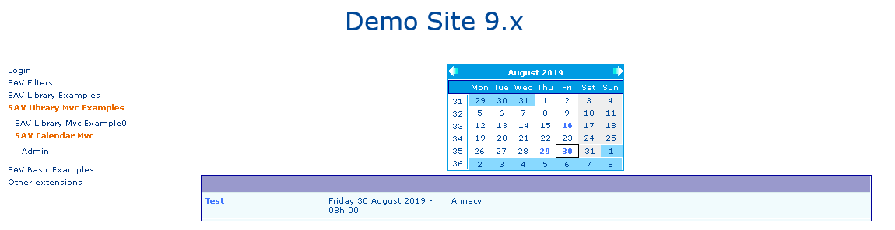
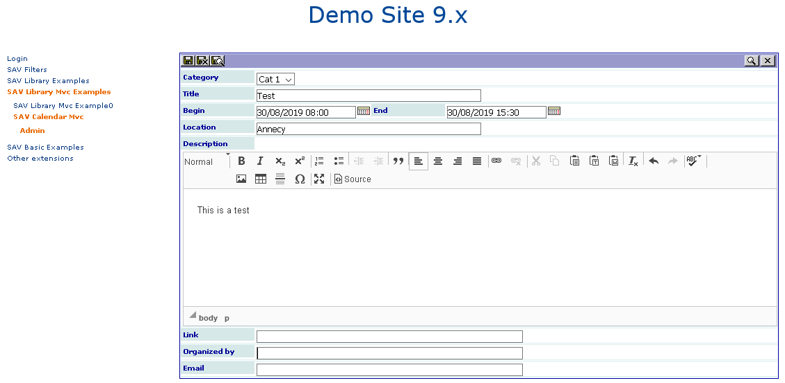

.. include:: ../Includes.txt

============
Introduction
============

What Does it Do?
================

This extension makes it possible to input and display events and their
related information. 

- Events are input by means of an **Admin** form.
- Events are displayed by means of a **Default** form.

A minicalendar can be added to filter the events by means of
the `sav_filters <https://typo3.org/extensions/repository/view/sav_filters>`_ 
extension.

Screenshots
===========

Events in the frontend with a minicalendar filter.

  
Event input in the frontend (**Admin** form)

