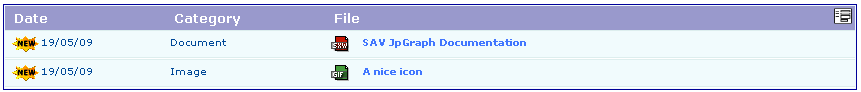
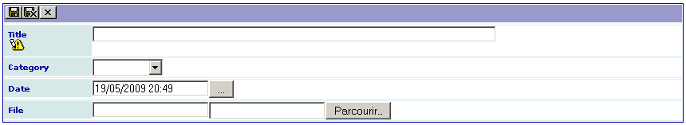

.. ==================================================
.. FOR YOUR INFORMATION
.. --------------------------------------------------
.. -*- coding: utf-8 -*- with BOM.

.. ==================================================
.. DEFINE SOME TEXTROLES
.. --------------------------------------------------
.. role::   underline
.. role::   typoscript(code)
.. role::   ts(typoscript)
   :class:  typoscript
.. role::   php(code)

Introduction
============

What does it do?
----------------

This extension was created with the `SAV Library Kickstarter <http://t
ypo3.org/extensions/repository/view/sav_library_kickstarter>`_ in
order to be used with the `SAV Library Plus
<http://typo3.org/extensions/repository/view/sav_library_plus>`_
extension.

The SAV Library Extension Kickstarter makes it possible to directly
build extensions  **without any PHP coding**, thanks to simple
configuration parameters.

The SAV Library Kickstarter includes:

- Creation of multiple views of the data,

- Front end input of the data,

- Views with folders,

- Context Sensitive Help,

- Generation of emails,

- Generation of RTF files using database tags,

- Data export in CSV format,

- Many other features.

This very simple extension makes it possible to download documents. A
new icon indicates the new documents during 15 days and icons are
associated with the file type (see the field configurations). Sorting
is available by clicking on “Date” or “Category” in the title bar.

Screenshots
-----------

