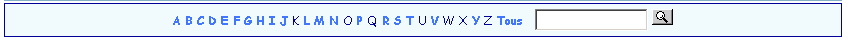

.. ==================================================
.. FOR YOUR INFORMATION
.. --------------------------------------------------
.. -*- coding: utf-8 -*- with BOM.

.. ==================================================
.. DEFINE SOME TEXTROLES
.. --------------------------------------------------
.. role::   underline
.. role::   typoscript(code)
.. role::   ts(typoscript)
   :class:  typoscript
.. role::   php(code)

Introduction
============

What does it do?
----------------

This extension is a filter for extensions built with the SAV Library
Kickstarter (see extension `sav\_library\_kickstarter <http://typo3.or
g/extensions/repository/view/sav_library_kickstarter>`_ and
`sav\_library\_plus
<http://typo3.org/extensions/repository/view/sav_library_plus>`_ ).

It displays a selection table with the first letter of the available
items in a given field of a table. A search box is also available.
Search is performed in the given field. Each letter is a link whose
parameters allow to retrieve all useful information from another
extension in the same page.

Screenshots
-----------

