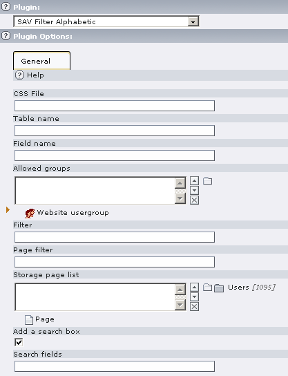
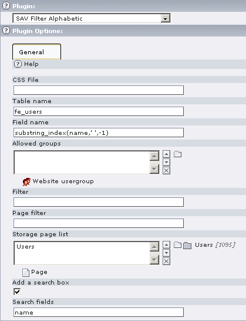
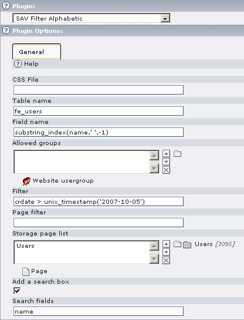
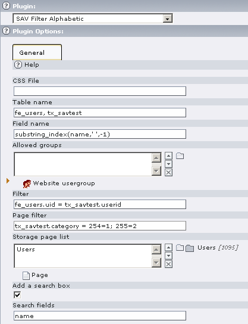

.. ==================================================
.. FOR YOUR INFORMATION
.. --------------------------------------------------
.. -*- coding: utf-8 -*- with BOM.

.. ==================================================
.. DEFINE SOME TEXTROLES
.. --------------------------------------------------
.. role::   underline
.. role::   typoscript(code)
.. role::   ts(typoscript)
   :class:  typoscript
.. role::   php(code)

User Manual
===========

Installation
------------

#. Download the extension from the TYPO3 Extension Repository and install
   it.

#. Insert the plugin in your page.

#. Edit the flexform plugin options and save.

**Help** : Context Sensitive Help. Click on the Question Mark Icon to
open the help window.

**CSS File** : Path to your CSS file if you do not want to use the
default one.

**Table Name** : Table name from which information are extracted.

**Field Name** : Field name from which information are extracted. If
several field names have to be used, separate them with a semicolon.

In specific cases when the extension is used as a filter for
extensions built with the SAV Library Extension Generator, an SQL
error“Column 'ColumnName' in where clause is ambiguous” can be
generated. It occurs, for example, when the same name is used in two
tables or when you use several languages for records. In such
cases,use the full field name syntax, that is “tableName.fieldName”.

**Allowed groups** : This field will limit the display to information
belonging to the selected groups

**Filter** : Use this field if you want to add a where clause to
select information.

**Page Filter** : see examples.

**Storage page list** : List of the pages where information are
searched. By default the page where the plugin is inserted is taken
into account.

**Add a search box** : a search box is added to the abc list. Search
is performed on the field name.

**Search fields** : semicolon-separated list of field names from which
information are searched. At least one search field must be added if
the search box is added.

Examples
--------

This configuration displays the selection list for users in
“fe\_users”, assuming fe\_users are defined in page “Users”. Since the
names are under the form “FirstName LastName”, only the LastName part
is kept by means of substring\_index(name,' ',-1). The resulting
selection table is:

Now assume that one wants the selection table to only includes users
created after October 5th, 2007. The configuration becomes:

And the display is now:

Finally, assume that we have defined a table “tx\_savtest” which
contains information associated with each user. This table contains a
field named “category” which defines the category associated which
each user. Now, we want to use sub-pages to select users belonging to
a specific category. Sub-pages are defined as shortcuts to the main
page where the plugin is inserted. The configuration will be:

The filter is used to link the table fe\_users and the table
tx\_savtest by means of the field userid. The page filter is the
following :

::

  table.field:pageid=category; .... ;pageid=category

The first sub-page has the id 254 and is associated with the category
1 while the second sub-page has the id 255 ans is associated with the
category 2.

Styles
------

The default style sheet is in the file
“Resources/Private/Styles/sav\_filter\_abc.css”