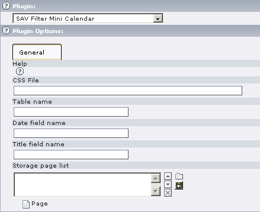
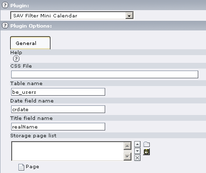

.. ==================================================
.. FOR YOUR INFORMATION
.. --------------------------------------------------
.. -*- coding: utf-8 -*- with BOM.

.. ==================================================
.. DEFINE SOME TEXTROLES
.. --------------------------------------------------
.. role::   underline
.. role::   typoscript(code)
.. role::   ts(typoscript)
   :class:  typoscript
.. role::   php(code)

Users manual
============

Installation
------------

#. Download the extension from the Typo3 Extension Repository and install
   it.

#. Insert the plugin in your page.

#. Edit the flexform plugin options and save.

**Help** : Context Sensitive Help. Click on the Question Mark Icon to
open the help window.

**CSS File** : Path to your CSS file if you do not want to use the
default one.

**Table name** : Table name from which information are extracted.

**Date field name** : Field name from which dates are extracted.

**Title field name** : Field name from which the title of the events
are extracted.

**Storage page list** : List of the pages where information are
searched. By default the page where the plugin is inserted is taken
into account.

Example
-------

This configuration displays a mini calendar where events are extracted
from the table “be\_users” and the field “crdate”., that is events are
the creation date of the BE users. The field to be used to display
items is “realName”, that is the real name of the BE users.

Styles
------

The default style sheet is in the file
“Resources/Private/Styles/sav\_filter\_minicalendar.css”

Default template
----------------

The default template is in the file
“Resources/Private/Templates/sav\_filter\_minicalendar.tmpl”.