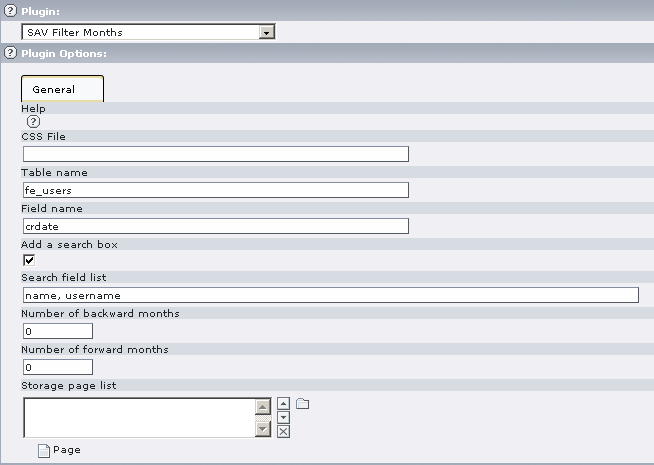

.. ==================================================
.. FOR YOUR INFORMATION
.. --------------------------------------------------
.. -*- coding: utf-8 -*- with BOM.

.. ==================================================
.. DEFINE SOME TEXTROLES
.. --------------------------------------------------
.. role::   underline
.. role::   typoscript(code)
.. role::   ts(typoscript)
   :class:  typoscript
.. role::   php(code)

Users manual
============

Installation
------------

#. Download the extension from the Typo3 Extension Repository and install
   it.

#. Insert the plugin in your page.

#. Edit the flexform plugin options and save.

**Help** : Context Sensitive Help. Click on the Question Mark Icon to
open the help window.

**CSS File** : Path to your CSS file if you do not want to use the
default one.

**Table Name** : Table name from which information are extracted.

**Field Name** : Field name from which information are extracted. If
several field names have to be used, separate them with a semicolon.

**Add a search box** : a search box is added to the abc list. Search
is performed on the field name

**Search Fields** : List of fields, separated by a comma, in which a
search can be performed.

**Number of backward months** : defines the forward months, that is
the number of months that will be displayed after the end of the
current year.

**Number of forward months** : defines the backward months, that is
the number of months that will be displayed before the beginning of
the current year.

**Storage page list** : List of the pages where information are
searched. By default the page where the plugin is inserted is taken
into account.

Styles
------

The default style sheet is in the file
“Resources/Private/Styles/sav\_filter\_months.css”

