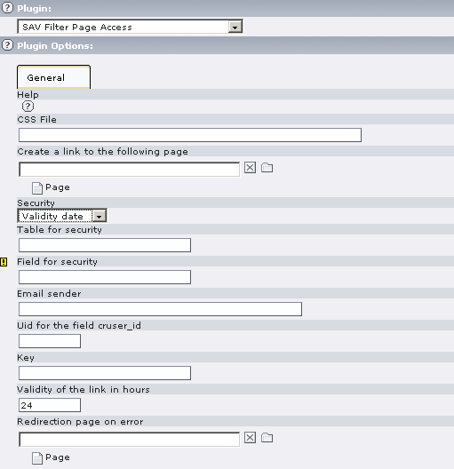
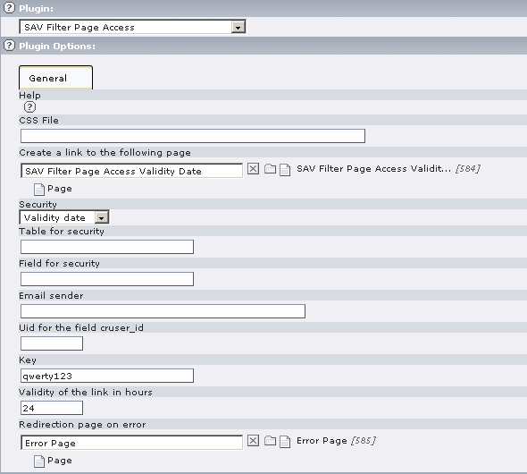
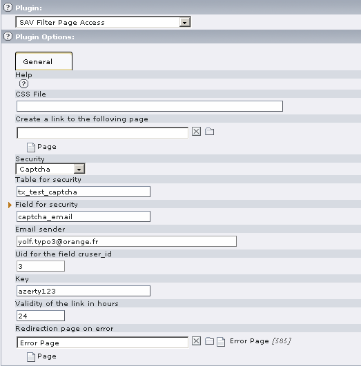
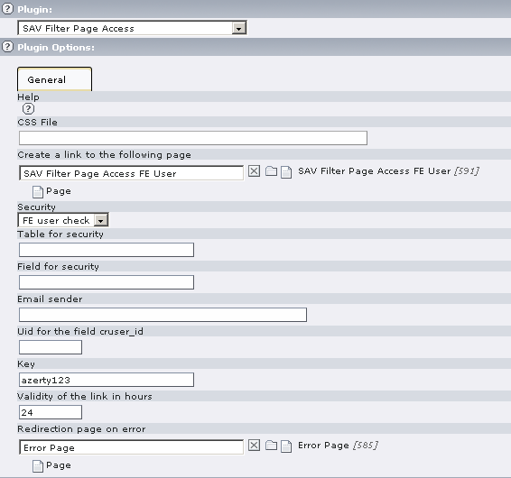
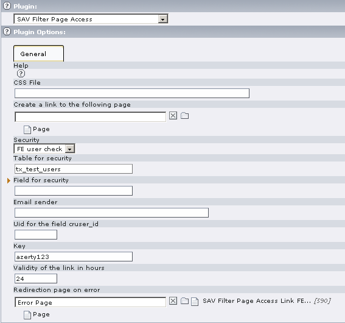

.. ==================================================
.. FOR YOUR INFORMATION
.. --------------------------------------------------
.. -*- coding: utf-8 -*- with BOM.

.. ==================================================
.. DEFINE SOME TEXTROLES
.. --------------------------------------------------
.. role::   underline
.. role::   typoscript(code)
.. role::   ts(typoscript)
   :class:  typoscript
.. role::   php(code)

Users manual
============

Installation
------------

#. Download the extension from the Typo3 Extension Repository and install
   it.

#. Insert the plugin in your page.

#. Edit the flexform plugin options and save.

**Help** : Context Sensitive Help. Click on the Question Mark Icon to
open the help window.

**CSS File** : Path to your CSS file if you do not want to use the
default one.

**Create a link to the following page** : If set, the extension will
create a link in relation with the security selector.

**Security** : Select here the type of security requested to access to
the page (Validity date, Captcha, FE User Check, User check from
table).

**Table for the security** : Table in relation with the security
selector.

**Field for the security** : Field in relation with the security
selector (the email for captcha will be saved here).

**Email sender** : Email to identify the sender of the message
containing the private link when Captcha is used. For example, use the
webmaster email or any other email that makes sense.

**Uid for the field cruser\_id** : uid that will be used as the
cruser\_id for the record associated with the user when Captcha is
used. For example, use the uid of an administrator.

**Key** : the key is a private information that will be used to build
the link.

**Validity of the link in hours** : If you use the Validity date for
the security, you can give a validity date to links. 24 hours is the
default value.

**Redirection page on error:** Set the page to redirect to in case of
errors.  **This field is required** .  **Be careful, for unknown
reason, the required icon is not at the right place.**

Examples
--------

Generating a link when security is set to “Validity Date”
^^^^^^^^^^^^^^^^^^^^^^^^^^^^^^^^^^^^^^^^^^^^^^^^^^^^^^^^^

The following screenshot shows how to generate a link that will give
access to the requested page (in this example “SAV Filter Page Access
Validity Date”).

Access to a page when security is set to “Validity Date”
^^^^^^^^^^^^^^^^^^^^^^^^^^^^^^^^^^^^^^^^^^^^^^^^^^^^^^^^

This case is useful when you want to give access to a group of users
without having them registered as FE users. For example, you may want
to provide a service on your site to partners but you do not have all
your partners as FE users. Your partners are registered on another
site. They will access to your service by means of a link which
contains the private key for controlling the page access.

You need to provide the key, the validity in hours and the redirection
page.

.. figure:: ../Images/ExamplePageAccessWithValidityDate.png

Generating a link outside TYPO3
^^^^^^^^^^^^^^^^^^^^^^^^^^^^^^^

The following php -code can be used to create a link to access to the
page. Put it in a file, e.g. “test.php” at the root of your site, and
replace the ”url” by your site url and “pageId” by the pageId of your
protected page.

::

   <?php
   
     function makeLink($config) {
       $keyCode = md5($config['key'].date('dmYH'));
       $target = ($config['target'] ? ' target="'.$config['target'].'"' : '');    
       $title = ($config['title'] ? ' title="'.$config['title'].'"' : '');
       $url = $config['url'].'/index.php?id='.$config['pageId'].'&tx_savfilterpageaccess_pi1[key]='.$keyCode;
       return '<a href="'.$url.'"'.$target.$title.'>'.$config['message'].'</a>';
     }  
   
     $config = array(
       'key' => 'qwerty123',
       'url' => 'http://localhost',
       'pageId' => 584,
       'target' => '_blank',
       'title' => 'Open the protected page in a new window',
       'message' => 'Access to the protected page',
     ); 
   
     echo  makeLink($config);
      
   ?>

Execute the script “test.php” and click on the link. Your protected
page is now opened in a new window. Access is granted for the validity
delay you have provided.

Using the extension with the captcha
^^^^^^^^^^^^^^^^^^^^^^^^^^^^^^^^^^^^

This case can be used when you want to control the access to an
extension built with the “SAV Library” to users that have previously
provided an email address. This is useful for services where the user
can freely input information in FE without being registered as a FE
users (for example, job offers). In particular, it is useful when you
create a “SAV Library” extension with an “Update Form” .

The email provided by the user is used to send him a message with a
private link to his/her record. The same user may have several
records. He/She will receive one different link for each record.

For the configuration, select captcha and provide the table name where
information will be saved. It's the table name used in your “SAV
Library” extension. Provide the field name where the email will be
saved. Be sure to have created this field in your extension. Provide
the sender email (for example your email) and the that will be used as
the cruser\_id (for example, your uid).

Go to your page ... answer to the captcha ... provide your email ...
and you should receive your personal link.

When you use the captcha configuration, the page access is not
controlled as in the previous case. It controls the access to your
“SAV Library Plus” extension that you should have inserted in the page
after this filter.

Generating a link when security is set to “FE User Check”
^^^^^^^^^^^^^^^^^^^^^^^^^^^^^^^^^^^^^^^^^^^^^^^^^^^^^^^^^

The following screenshot shows how to generate a link that will
control the access to extensions generated with the “SAV Library”
which are in the requested page (in this example “SAV Filter Page
Access FE User”).

Access to a page when security is set to “FE User Check”
^^^^^^^^^^^^^^^^^^^^^^^^^^^^^^^^^^^^^^^^^^^^^^^^^^^^^^^^

This case is useful when you want to give access to a FE User to an
“update Form” in an extension built with the “SAV Library”. It makes
it possible for the user to fill his/her form. The record in the table
(here tx\_test\_users) is created when the FE user clicks on the
access link for the first time. Then, the user may update the data by
clicking on the access link.

Access to a page when security is set to “User Check from table”
^^^^^^^^^^^^^^^^^^^^^^^^^^^^^^^^^^^^^^^^^^^^^^^^^^^^^^^^^^^^^^^^

Use this case when you want to control the access to a page by
checking if the URL parameter contains a correct crypted key. In
general, you will have a user information in a field (field for
security) in a given table (table for security), for example it can be
the user email or any other information.

To grant access, the URL of the page must contain the following
parameter:

&tx\_savfilterpageaccess\_pi1[key]=cryptedValue

The crypted value must be the md5 of the concatenation of the value,
for the user, of the field for security in the table for security and
the key information.

Styles
------

The default style sheet is in the file
“Resources/Private/Styles/sav\_filter\_pageaccess.css”

