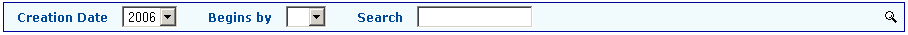

.. ==================================================
.. FOR YOUR INFORMATION
.. --------------------------------------------------
.. -*- coding: utf-8 -*- with BOM.
.. ==================================================
.. DEFINE SOME TEXTROLES
.. --------------------------------------------------
.. role::   underline
.. role::   typoscript(code)
.. role::   ts(typoscript)
   :class:  typoscript
.. role::   php(code)

Introduction
============

What does it do?
----------------

This extension is a filter for extensions built with the SAV Library
Kickstarter (see extension `sav\_library\_kickstarter <http://typo3.or
g/extensions/repository/view/sav_library_kickstarter>`_ and
`sav\_library\_plus
<http://typo3.org/extensions/repository/view/sav_library_plus>`_ ).

It displays selectors, checkboxes, search field, ... to select items 
in SAV Library extensions. This extension works correctly although it is still 
in beta state.

Screenshots
-----------

