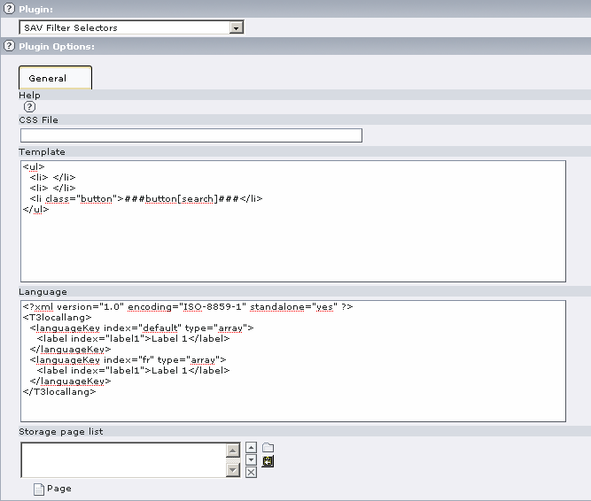
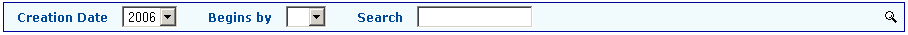
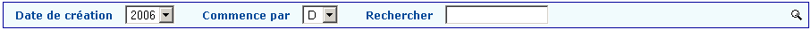
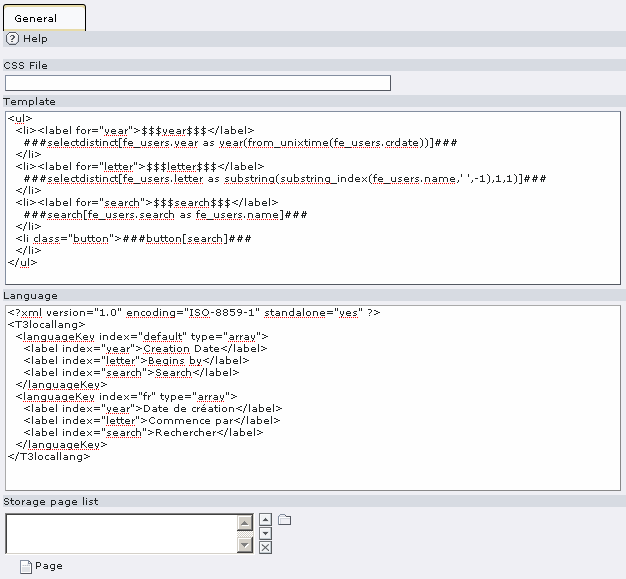

.. ==================================================
.. FOR YOUR INFORMATION
.. --------------------------------------------------
.. -*- coding: utf-8 -*- with BOM.

.. ==================================================
.. DEFINE SOME TEXTROLES
.. --------------------------------------------------
.. role::   underline
.. role::   typoscript(code)
.. role::   ts(typoscript)
   :class:  typoscript
.. role::   php(code)

Users manual
============

Installation
------------

#. Download the extension from the Typo3 Extension Repository and install
   it.

#. Insert the plugin in your page.

#. Edit the flexform plugin options and save.

**Help** : Context Sensitive Help. Click on the Question Mark Icon to
open the help window.

**CSS File** : Path to your CSS file if you do not want to use the
default one.

**Template** : Template for the selectors. A default template is
inserted..

**Language** : xml language definition of label which are used in the
template as $$$tag$$$.

**Storage page list** : List of the pages where information are
searched. By default the page where the plugin is inserted is taken
into account.

Examples
--------

Use the Context Sensitive Help to get information about this
extension. It offers many possibilities to define selectors.

In the following example, we will define two selectors and one search
box with labels using localization as shown below with a default and a
French language settings.

In order to obtain this result, the following configuration is used.

Let us examine the template:

.. code-block:: html
  :linenos:
 

  <ul>
    <li><label for="year">$$$year$$$</label>
      ###selectdistinct[fe_users.year as year(from_unixtime(fe_users.crdate))]###
    </li>
    <li><label for="letter">$$$letter$$$</label>
      ###selectdistinct[fe_users.letter as substring(substring_index(fe_users.name,' ',-1),1,1)]###
    </li>
    <li><label for="search">$$$search$$$</label>
      ###search[fe_users.search as fe_users.name]###
    </li>
    <li class="button">###button[search]###
    </li>
  </ul>

The template is based on an unordered list.

In line 2, a label tag is defined for the first selector box. The
information to display will be taken from the label “year” in the
language definition part, that is it will be replaced by “Creation
date” for the default language and “Date de création” in french.

In line 3, the selector is defined.

#. “###selectdistinct[....]###” means that the selector will contain only
   distinct value.

#. fe\_users.letter means that the table “fe\_users” is used and “letter”
   is the id of the selector. It must be coherent with the “for” part of
   the label tag.

#. “as year(from\_unixtime(fe\_users.crdate))” is the information that
   will be used in the query part of the filter. Here, we take the year
   of the crdate in the table fe\_users. You can use regular SQL
   statement here.

In line 5, a new label tag is defined for the second selector.

In line 6, we take the first letter of the “name” field in the table
fe\_users. Therefore, the selector will contain the first letter of
the fe-users' name (use the storage pid list to restrict to specific
pages).

In line 8, a new label tag is defined for the search box.

In line 9, a search box is defined. The search will be performed in
the field “name” in fe\_users.

In line 11, a search button is defined.

Styles
------

The default style sheet is in the file
“Resources/Private/Styles/sav\_filter\_selectors.css”

