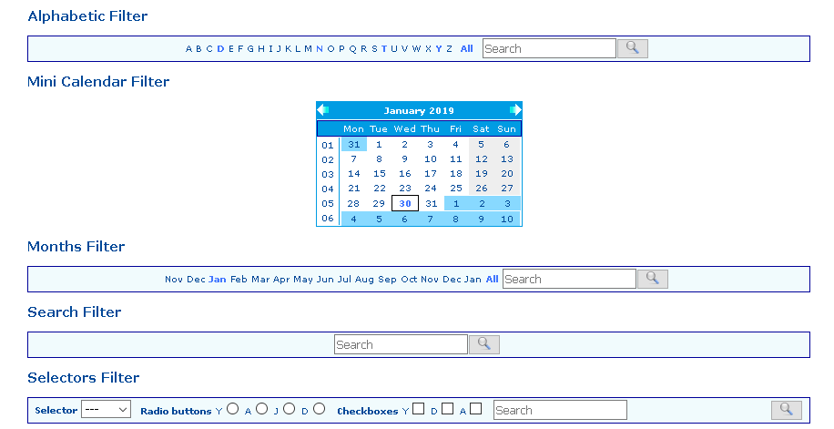

.. include:: ../Includes.txt

.. _introduction:

============
Introduction
============

What Does it Do?
================

This extension provides filters for extensions built with the SAV Library
Kickstarter (see extension `sav\_library\_kickstarter <http://typo3.or
g/extensions/repository/view/sav_library_kickstarter>`_ and
`sav\_library\_plus
<http://typo3.org/extensions/repository/view/sav_library_plus>`_ ).

This extension replaces the following deprecated extensions:

- SAV Filter Alphabetic (sav_filter_abc)
- SAV Filter Mini Calendar (sav_filter_minicalendar)
- SAV Filter Months (sav_filter_months)
- SAV Filter Search (sav_filter_search) 
- SAV Filter Selectors (sav_filter_selectors)
- SAV Filter Page Access (sav_filter_pageaccess)

It includes a debug feature.

Screenshots
===========

