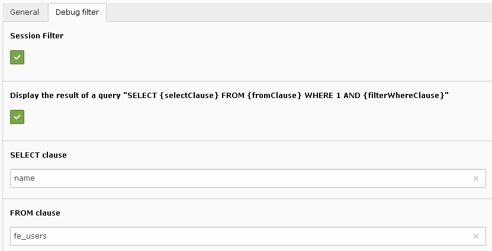
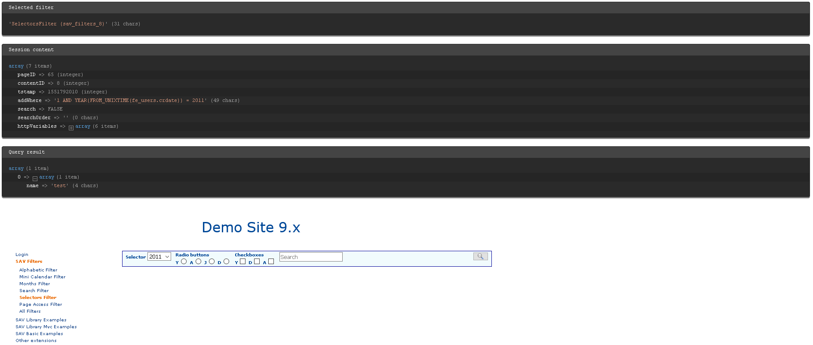

.. include:: ../../Includes.txt

.. _debugFilter:

============
Debug Filter
============

The debug filter provides a debugging feature to:

- display, by default, the content of the session filter which is used by SAV Library Plus. In particular it shows the real content of the WHERE clause that will be added to 
  queries in the list mode of the SAV Library Plus extension (addWhere variable).
- display the result of a query which uses the added WHERE clause.

  
The following caption shows the display generated by the debug filter. Only one FE users was created in 2011.  
  

  