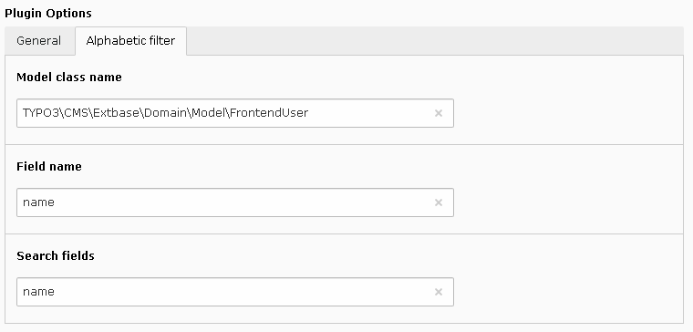

.. include:: ../../../Includes.txt

.. _savLibraryMvc.alphabeticFilter:

=================
Alphabetic Filter
=================

The configuration folder for the alphabetic filter contains several fields
to build the information used to generate the list of active letters.
In the following example, the query returns the first letter of the names 
of the frontend users. 

 
.. important::

   The model class name does not start by an antislash as shown below:
   
   .. code::

      TYPO3\CMS\Extbase\Domain\Model\FrontendUser
   
The field name is the name as it appears in the table. For example, 
to use the last name one has to use **last_name** as a the field name.

The search fields must be comma-separated.
