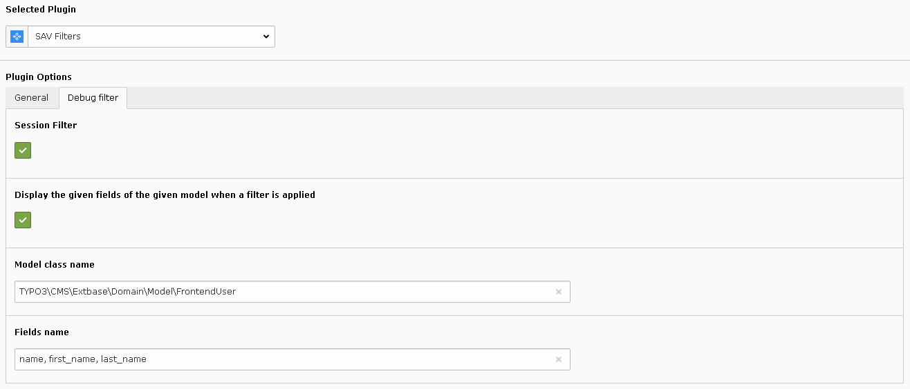

.. include:: ../../../Includes.txt

.. _savLibraryMvc.debugFilter:

============
Debug Filter
============

The debug filter provides a debugging feature to:

- Display, by default, the content of the session filter which is used by 
  SAV Library Mvc.
- Display the given fields for the given model when a filter is applied.

  
  