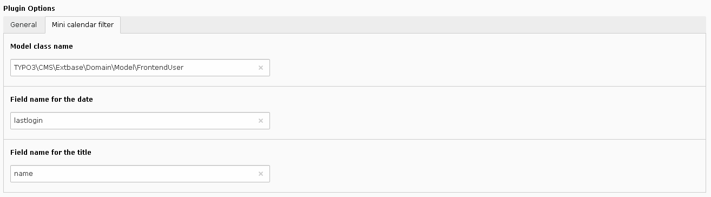

.. include:: ../../../Includes.txt

.. _savLibraryMvc.minicalendarFilter:

===================
Minicalendar Filter
===================

The configuration of the filter is the same as in the alphabetic filter.
In the following example, the query returns the months where frontend 
users were last logged. 

   