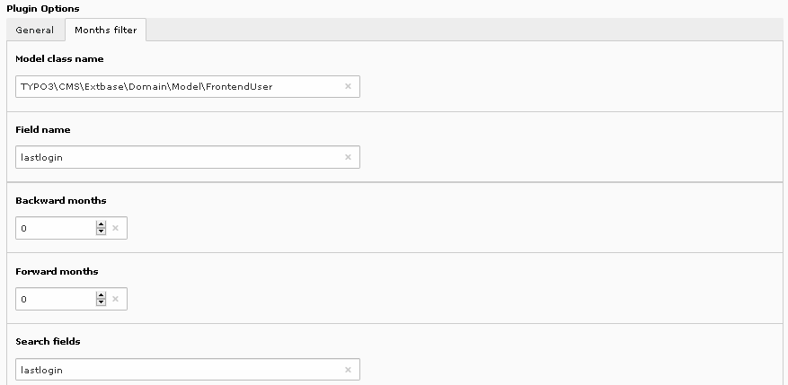

.. include:: ../../../Includes.txt

.. _savLibraryMvc.monthsFilter:

=============
Months Filter
=============

The configuration of the months filter are the same as in the alphabetic filter.
In the following example, the query returns the months where frontend 
users were last logged. 

  
The search fields must be comma-separated.
