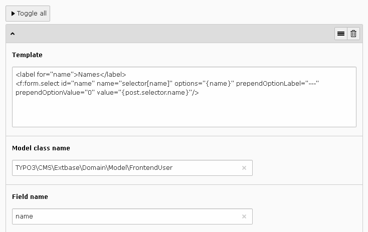

.. include:: ../../../Includes.txt

.. _savLibraryMvc.selectorsFilter:

================
Selectors Filter
================

The selectors filter makes it possible to build filters from Extbase models
including selectors and search boxes.
  
The configuration flexform for each item includes:

- A template field.
- A model class name.
- A field.

Creating a Selector
===================

The template field uses the Fluid syntax. The Fluid variable **{my_variable}** 
will be replaced by the value provided by the getter **getMyVariable()** in 
the model class.

The following configuration produces a selector whose values and labels are the names
of the frontend users.

   
Let us analyze the following template.

.. code::

   <label for="name">Names</label>
   <f:form.select id="name" name="selector[name]" options="{name}" prependOptionLabel="---" prependOptionValue="0" value="{post.selector.name}"/>

- The **name** attribute of the **form.select** viewhelper must
  be **selector[my_field]**.
- The **options** attribute is provided bu the getter **getName()** in the class
  **\TYPO3\CMS\Extbase\Domain\Model\FrontendUser**.
- The **value** attribute is recovered using the syntax **post.selector.my_field**. 

The Fluid variable **{_fields}** is available to build options whose values
are different from the labels. In the following template, this Fluid
variable is used with the attributes **optionValueField** and **optionLabelField**
to produce a selector whose labels are the names of the frontend users and 
the values their **uid**. 

.. code::

   <label for="nameWithId">Names with id</label>
   <f:form.select id="nameWithId" name="selector[uid]" options="{_fields_}" optionValueField="uid" optionLabelField="name" prependOptionLabel="---" prependOptionValue="0" value="{post.selector.uid}"/>
  
Creating a Search Box
=====================

A search box is created using the **form.textfield** viewhelper as shown below.

.. code::

   <label for="search">Search</label>
   <f:form.textfield id="search" name="search[name]"  value="{post.search.name}"/>
 
- The **name** attribute of the **form.textfield** viewhelper must
  be **search[my_field]**.   
- The **value** attribute is recovered using the syntax **post.search.my_field**.   
