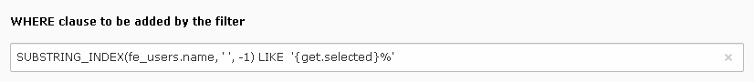
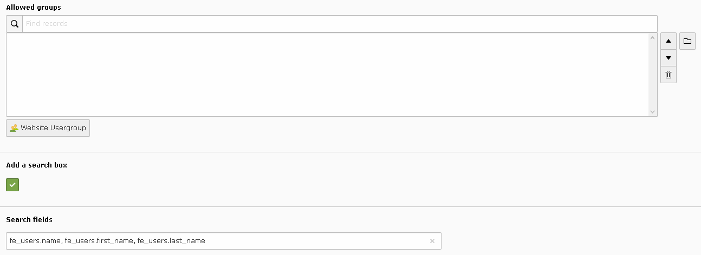

.. include:: ../../../Includes.txt

.. _savLibraryPlus.alphabeticFilter:

=================
Alphabetic Filter
=================

The configuration folder for the alphabetic filter contains several fields
to build the query that will be used to generate the list of active letters.
In the following example, the query returns the first letter of the names 
of the frontend users. 

.. figure:: ../../../Images/SavLibraryPlusAlphabeticFilterQueryInBackEnd.png
  :alt: Query for the alphabetic filter
  
.. note::

   INNER JOIN part can be added in the FROM field.

The configuration folder contains also a field whose content is the **WHERE** 
clause to be added by the filter. In the following example, the filter 
will add a restriction to the selected letter. 
The FLUID variable **selected** used in the template must be prepended by **get**. 

  
Finally, the alphabetic filter includes the restriction to frontend 
groups and makes it possible to add a search box.
The search fields must be coma-separated.

.. important::

   In specific cases you may want to associate functions with a field like, 
   for example, **CONCAT**. In such a case, if you need to use commas in the 
   function, please escape them with an **\\**. 
	
   The following example should be used to search in the field names, 
   **fisrt_name**, **last_name** of the table **fe_users** and in the concatenation 
   of the first name and the last name in the same table.
	
   .. code::
	
      fe_users.name, fe_users.first_name, fe_users.last_name, CONCAT(fe_users.first_name\, ' '\, fe_users.last_name)
