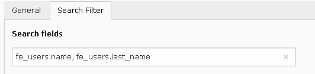

.. include:: ../../../Includes.txt

.. _savLibraryPlus.searchFilter:

=============
Search Filter
=============

The search filter is a very simple filter which makes it possible to search
a given input in database fields. The flexform configuration contains 
one field in which the list of comma-separated database fields are input 

.. important::
  
   In specific cases you may want to associate functions with a field like, 
   for example, **CONCAT**. In such a case, if you need to use commas in the 
   function, please escape them with an **\\**. 
	
   The following example should be used to search in the field 
   **last_name** of the table **fe_users** and in the concatenation 
   of the first name and the last name in the same table.
	
   .. code::
	
      fe_users.name, fe_users.last_name, CONCAT(fe_users.first_name\, ' '\, fe_users.last_name)