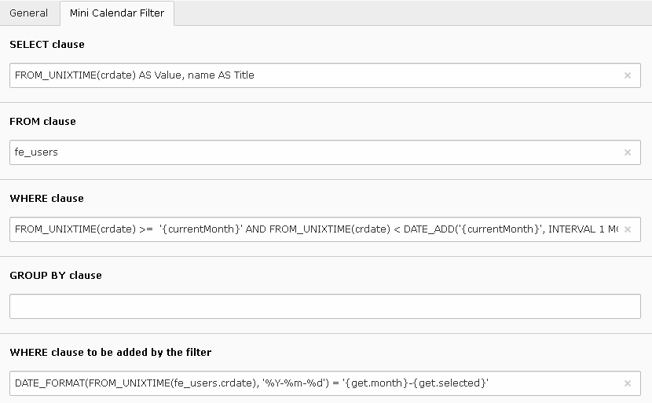

.. include:: ../../Includes.txt

.. _minicalendarFilter:

===================
Minicalendar Filter
===================

The configuration of the query is the same as in the alphabetic filter.
In the following example, the calendar displays the creation of FE users. The user name is used as a title attribute for the links.

 
The variable {currentMonth} is replaced by the current month represented in the format YYYY-MM. The query WHERE clause
retricts the records whose crdate is within the current month.

.. code::

	FROM_UNIXTIME(crdate) >=  '{currentMonth}' AND FROM_UNIXTIME(crdate) < DATE_ADD('{currentMonth}', INTERVAL 1 MONTH) 
 

  