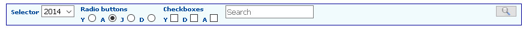
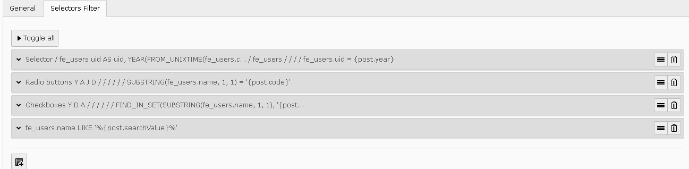
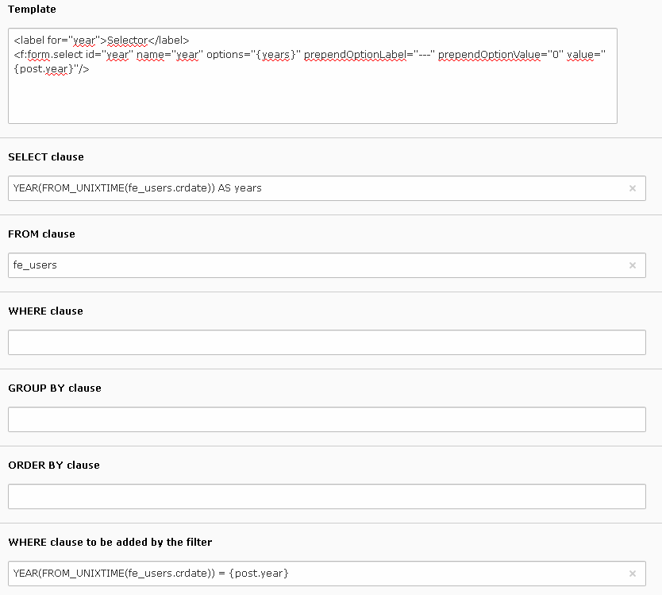
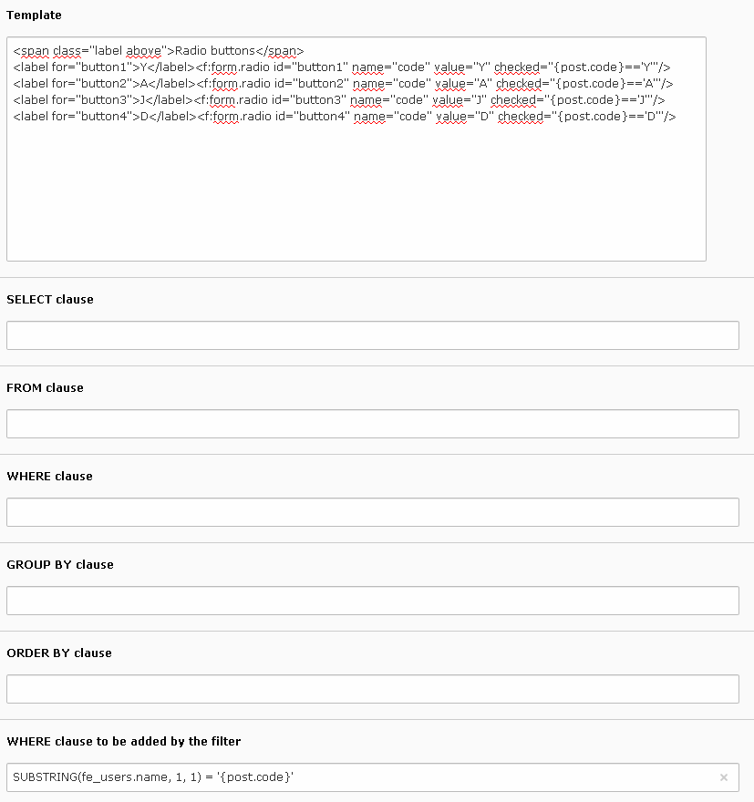
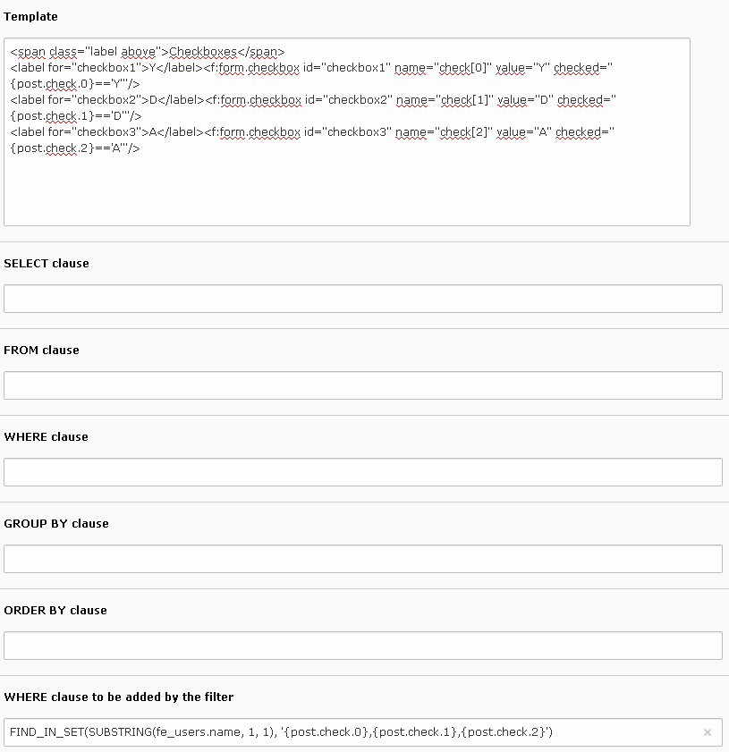
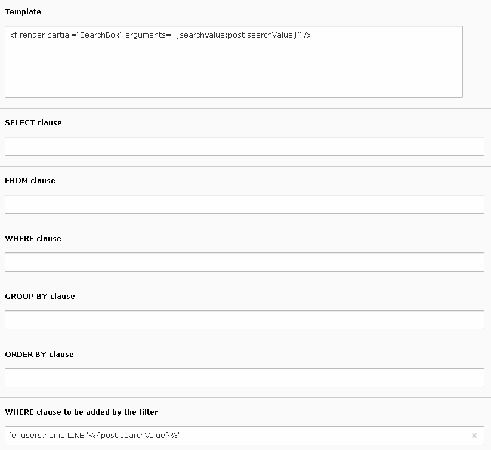

.. include:: ../../Includes.txt

.. _selectorsFilter:

================
Selectors Filter
================

The selectors filter is a powerful tool to build filters including selector lists, 
radio buttons, checkboxes... The following caption illustrates the result, in 
the front end, of the configuration described in this section.

Each item in the selector has its own configuration in the flexform.

  
The configuration flexform for each item includes:

- A template field.
- Several fields for a query.
- A field for the **WHERE** clause to be added by the filter.

Creating a Selector
===================

The following caption illustrates the configuration to build a selector containing 
the years where frontend users were created.

The template field uses the FLUID syntax. The FLUID variable **{years}** 
is provided by the result of the query where the alias **years** is generated 
from the **crdate**. The POST variable **year** is recovered in the FLUID 
variable **{post.year}**.

.. code::

   <label for="year">Selector</label>
   <f:form.select id="year" name="year" options="{years}" prependOptionLabel="---" prependOptionValue="0" value="{post.year}"/>    

.. note::

   In this example the values associated with the selector are the years. 
   To associate different values to  the selector, for example uid's in 
   the case of a cateragory based selector, please add a label **uid** 
   in the **SELECT** clause. For example, modifying the **SELECT** clause 
   as shown below generates a selector whose values are the short year 
   value. Since the POST value is now the short year, of course 
   the **WHERE** clause to be added by the filter must be modified in accordance).
	
   .. code::
		
      SUBSTRING(YEAR(FROM_UNIXTIME(fe_users.crdate)), -2) AS uid, YEAR(FROM_UNIXTIME(fe_users.crdate)) AS years
	
Creating Radio Buttons
======================

The following caption illustrates the configuration to build four radio 
buttons respectively associated with the letters Y, A, J, D. 
The **WHERE** clause added by the filter makes a restriction on the frontend 
users names starting by these letter. As it can be seen, no query is used in 
this example, FLUID view helper for radio buttons is simply used.

  
.. note::

   In this example the  tag includes the attribute **class="above label"**. 
   These CSS classes are defined in the extension stylesheet. The class **above** makes 
   it possible to have information above the items (the radio buttons in this example). 
   The class **label** sets the attribute exactly as the ones use for the **<label>** tag. 
	
 	
Creating Checkboxes
===================

Creating checkboxes is very similar to create radio buttons. The FLUID 
view helper for checkboxes is used and the **WHERE** clause to be added by the filter 
is modified in accordance.
 

  
Creating a Search Box
=====================

A search box can be easily created using the partial **SearchBox** provided 
withthe extension. It uses a FLUID variable **{searchValue}** which is used
in the **WHERE** clause to be added by the filter.

