.. include:: ../Includes.txt

.. _introduction:

============
Introduction
============

What Does it Do?
================

This extension was created with the `SAV Library Kickstarter 
<https://typo3.org/extensions/repository/view/sav_library_kickstarter>`_ in
order to be used with the `SAV Library Plus
<https://typo3.org/extensions/repository/view/sav_library_plus>`_
extension.

The SAV Library Extension Kickstarter makes it possible to directly
build extensions  **without any PHP coding**, thanks to simple
configuration parameters.

The SAV Library Kickstarter includes:

- Creation of multiple views of the data,

- Frontend input of the data,

- Views with folders,

- Context Sensitive Help,

- Generation of emails,

- Generation of RTF files using database tags,

- Data export in CSV format,

- Many other features.

This example is a test extension which illustrates several features of the 
SAV Library Plus extension. 

.. important::

  For more information, please read the
  :ref:`SAV Library Kickstarter tutorial section <savlibrarykickstarter:tutorial>`.

Screenshots
===========

List View
---------

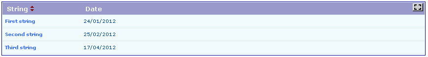

Single View
-----------

.. figure:: ../Images/ScreenshotsSingleViewCheckboxesAndRadioFolder.png 

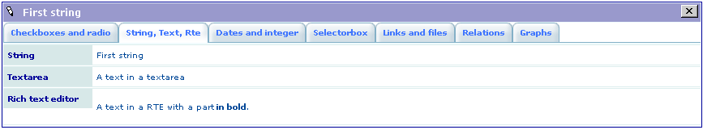

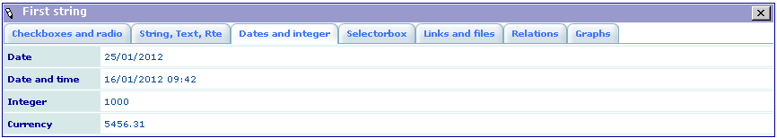

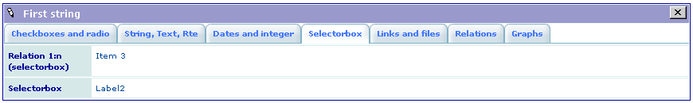

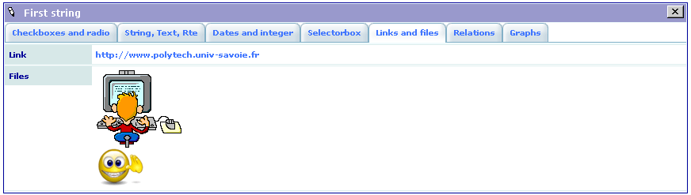

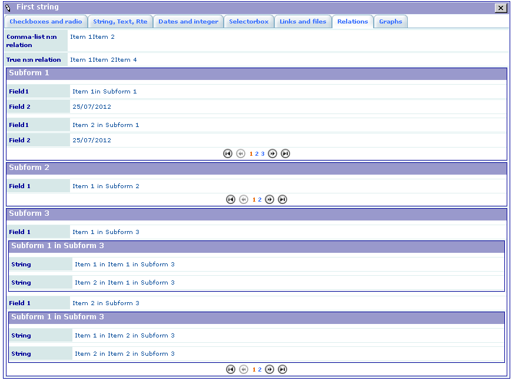

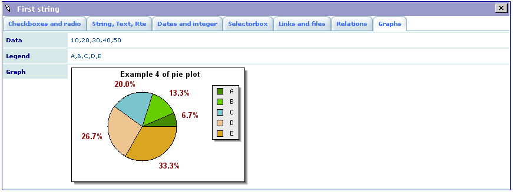

Edit View
---------

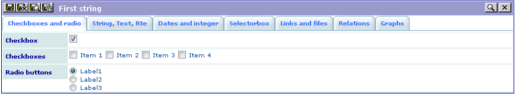

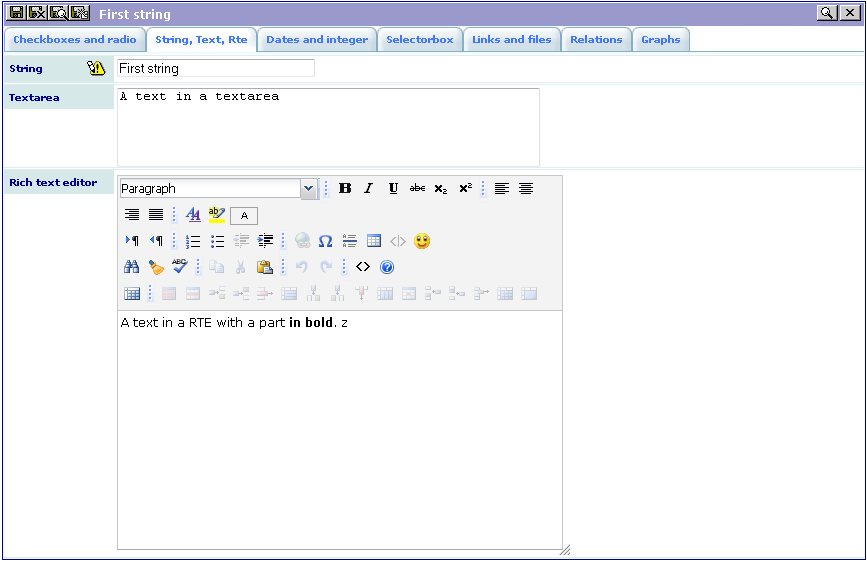

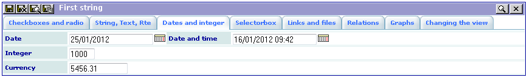

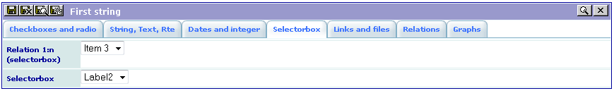

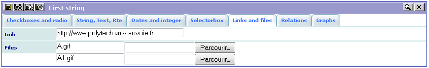

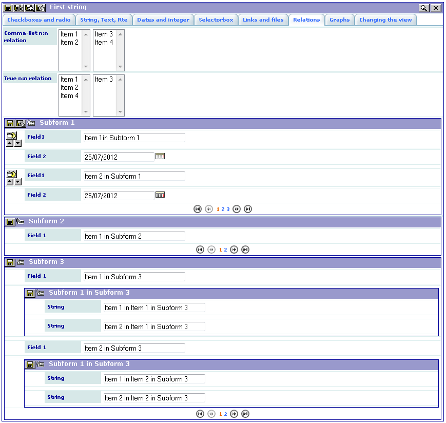

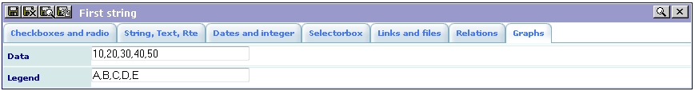

Changing Dynamically the Folder
-------------------------------

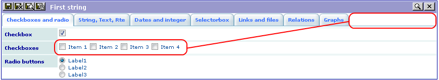

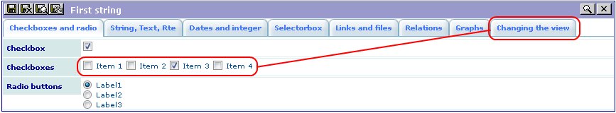

Changing Dynamically the View
-----------------------------

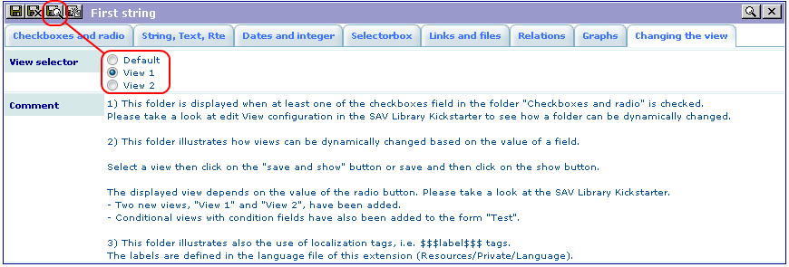

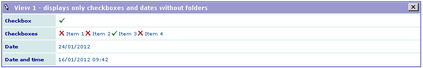

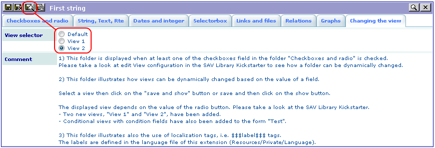

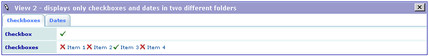