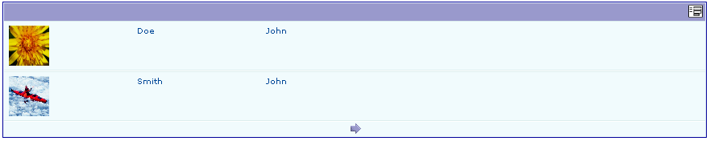

.. ==================================================
.. FOR YOUR INFORMATION
.. --------------------------------------------------
.. -*- coding: utf-8 -*- with BOM.

.. ==================================================
.. DEFINE SOME TEXTROLES
.. --------------------------------------------------
.. role::   underline
.. role::   typoscript(code)
.. role::   ts(typoscript)
   :class:  typoscript
.. role::   php(code)

Introduction
============

What does it do?
----------------

This extension was created with the `SAV Library Kickstarter <http://t
ypo3.org/extensions/repository/view/sav_library_kickstarter>`_ in
order to be used with the `SAV Library Plus
<http://typo3.org/extensions/repository/view/sav_library_plus>`_
extension.

The SAV Library Extension Kickstarter makes it possible to directly
build extensions  **without any PHP coding**, thanks to simple
configuration parameters.

The SAV Library Kickstarter includes:

- Creation of multiple views of the data,

- Front end input of the data,

- Views with folders,

- Context Sensitive Help,

- Generation of emails,

- Generation of RTF files using database tags,

- Data export in CSV format,

- Many other features.

This example creates a contact list with the first name, last name,
street, zip code, city and an image of the contact. It is taken from
`http://www.typo3journal.info/articles/developpement.html
<http://www.typo3journal.info/articles/developpement.html>`_ .

.. important::

  For more information, please read the
  :ref:`Tutorial 1 section of the SAV Library Plus documentation <savlibraryplus:tutorial1>`.

Screenshots
-----------

List view
^^^^^^^^^

Single view
^^^^^^^^^^^

.. figure:: ../Images/ScreenshotsSingleView.png 

Edit view
^^^^^^^^^

.. figure:: ../Images/ScreenshotsEditView.png 

