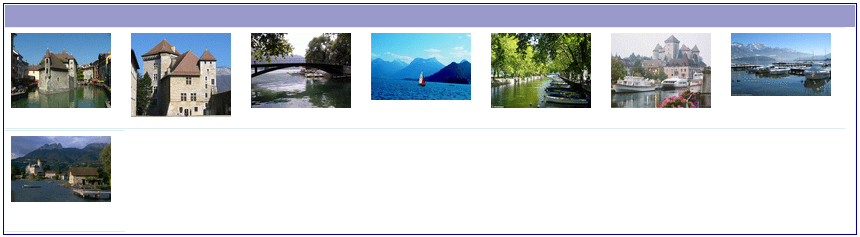
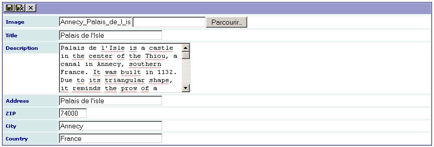
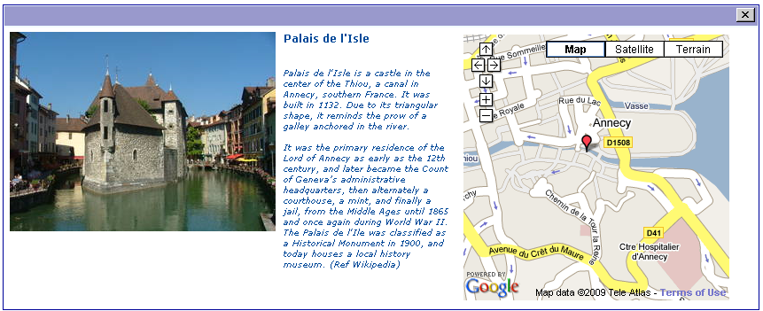

.. ==================================================
.. FOR YOUR INFORMATION
.. --------------------------------------------------
.. -*- coding: utf-8 -*- with BOM.

.. ==================================================
.. DEFINE SOME TEXTROLES
.. --------------------------------------------------
.. role::   underline
.. role::   typoscript(code)
.. role::   ts(typoscript)
   :class:  typoscript
.. role::   php(code)

Introduction
============

What does it do?
----------------

This extension was created with the `SAV Library Kickstarter <http://t
ypo3.org/extensions/repository/view/sav_library_kickstarter>`_ in
order to be used with the `SAV Library Plus
<http://typo3.org/extensions/repository/view/sav_library_plus>`_
extension.

The SAV Library Extension Kickstarter makes it possible to directly
build extensions  **without any PHP coding**, thanks to simple
configuration parameters.

The SAV Library Kickstarter includes:

- Creation of multiple views of the data,

- Front end input of the data,

- Views with folders,

- Context Sensitive Help,

- Generation of emails,

- Generation of RTF files using database tags,

- Data export in CSV format,

- Many other features.

The aim of this extension is to show how to use TypoScript into an extension.
A gallery of pictures is diplayed. For the sake of the simplicity only
three views in one form are used (see the extension `sav_library_example9
<http://typo3.org/extensions/repository/view/sav_library_example9>`_
to create an admin form) :

- The "List" view displays small images. 

- The “Edit” view is used to enter the picture, its title, a description and 
  the address corresponding to the picture. 

- The “Single” view has a special organization. The picture is on the left,
  then the title and the description is displayed at the right of the picture 
  and, finally, the google map, where the marker is defined by the address, 
  goes to the right of the description. By clicking on the image, it should be 
  displayed in its original size.

Several authenticated users may use the plugin. Each user can modify or delete the record he/she has created.

.. important::

  For more information, please read the
  :ref:`Tutorial 10 section of the SAV Library Plus documentation <savlibraryplus:tutorial10>`.

Screenshots
-----------

List View
^^^^^^^^^

Edit View
^^^^^^^^^

Single View
^^^^^^^^^^^
