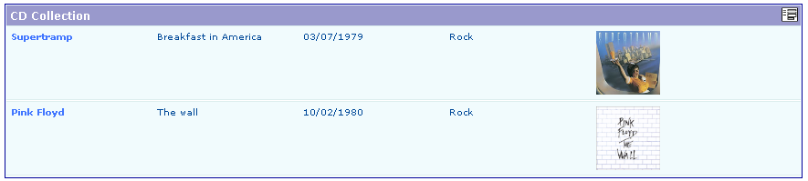
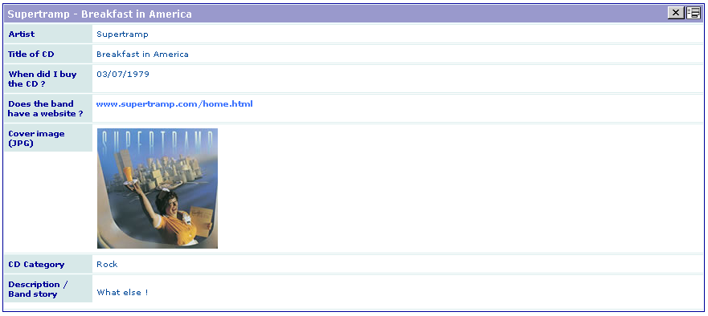
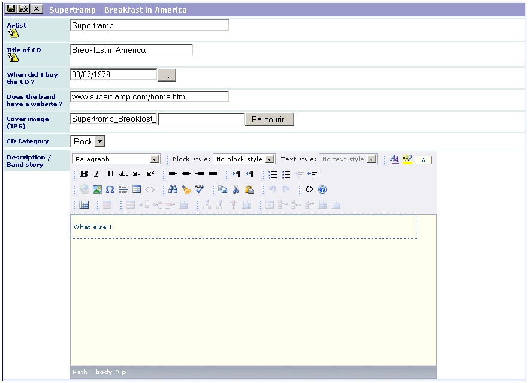

.. include:: ../Includes.txt

.. _introduction:

============
Introduction
============

What Does it Do?
================

This extension was created with the `SAV Library Kickstarter <http://t
ypo3.org/extensions/repository/view/sav_library_kickstarter>`_ in
order to be used with the `SAV Library Plus
<http://typo3.org/extensions/repository/view/sav_library_plus>`_
extension.

The SAV Library Extension Kickstarter makes it possible to directly
build extensions  **without any PHP coding**, thanks to simple
configuration parameters.

The SAV Library Kickstarter includes:

- Creation of multiple views of the data,

- Frontend input of the data,

- Views with folders,

- Context Sensitive Help,

- Generation of emails,

- Generation of RTF files using database tags,

- Data export in CSV format,

- Many other features.

This example is taken from Kasper's video Episode III
(http://typo3.org/documentation/videos/wmv-format/). It creates a list
of CD albums. It includes artist name, title of the album, date of
purchase, cover image, artist web link, category fields.

.. important::

  For more information, please read the
  :ref:`Tutorial 2 section of the SAV Library Plus documentation <savlibraryplus:tutorial2>`.

Screenshots
===========

List View
---------

Single View
-----------

Edit View
---------

