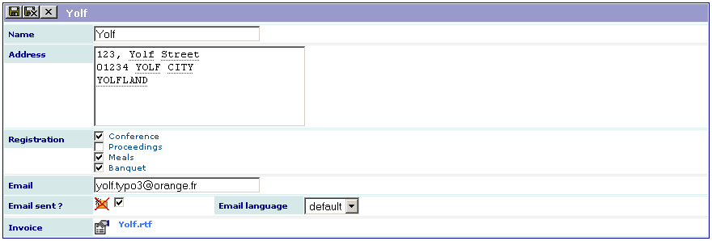

.. include:: ../Includes.txt

.. _introduction:

============
Introduction
============

What Does it Do?
================

This extension was created with the `SAV Library Kickstarter <http://t
ypo3.org/extensions/repository/view/sav_library_kickstarter>`_ in
order to be used with the `SAV Library Plus
<http://typo3.org/extensions/repository/view/sav_library_plus>`_
extension.

The SAV Library Extension Kickstarter makes it possible to directly
build extensions  **without any PHP coding**, thanks to simple
configuration parameters.

The SAV Library Kickstarter includes:

- Creation of multiple views of the data,

- Frontend input of the data,

- Views with folders,

- Context Sensitive Help,

- Generation of emails,

- Generation of RTF files using database tags,

- Data export in CSV format,

- Many other features.

This example shows how emails and RTF file generation can be used. 
Its objective is a very simple conference registration tool. 
It contains different fields:

- the participant name,

- the participant address,

- the registration items,

- the participant email,

- the email flag which is used to send emails,

- the email language,

- the link for the RTF file. 

.. important::

  For more information, please read the
  :ref:`Tutorial 6 section of the SAV Library Plus documentation <savlibraryplus:tutorial6>`.

Screenshots
===========

