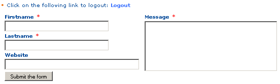
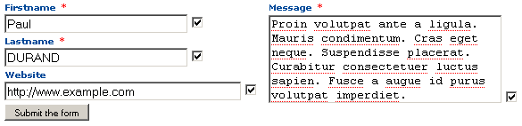
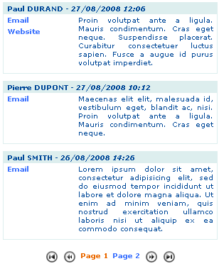
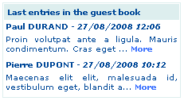

.. include:: ../Includes.txt

.. _introduction:

============
Introduction
============

What Does it Do?
================

This extension was created with the `SAV Library Kickstarter <http://t
ypo3.org/extensions/repository/view/sav_library_kickstarter>`_ in
order to be used with the `SAV Library Plus
<http://typo3.org/extensions/repository/view/sav_library_plus>`_
extension.

The SAV Library Extension Kickstarter makes it possible to directly
build extensions  **without any PHP coding**, thanks to simple
configuration parameters.

The SAV Library Kickstarter includes:

- Creation of multiple views of the data,

- Frontend input of the data,

- Views with folders,

- Context Sensitive Help,

- Generation of emails,

- Generation of RTF files using database tags,

- Data export in CSV format,

- Many other features.

The aim of this extension is to deal with multiple forms of the same
table and to explain how update views can be used. It creates a guest book
which is inspired from the extension “ve_guestbook ” (Modern guest book)
available in the TER.
 
This extension uses a table with the following fields:

- the guest firstname,

- the guest lastname,

- the guest email,

- the guest website,

- the guest message,

- a comment field.

.. important::

  For more information, please read the
  :ref:`Tutorial 7 section of the SAV Library Plus documentation <savlibraryplus:tutorial7>`.

Screenshots
===========

Guest Edit View
---------------

Guest Admin List and Edit Views
-------------------------------

List View
---------

Teaser View
-----------

