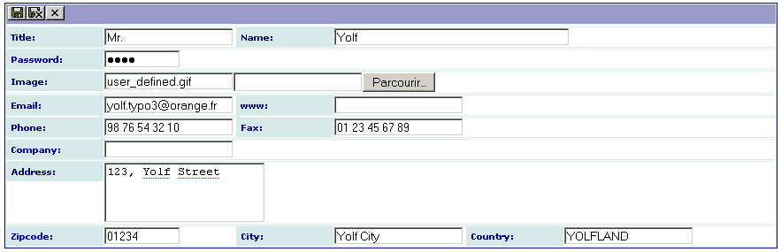
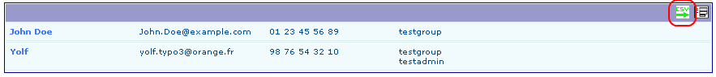
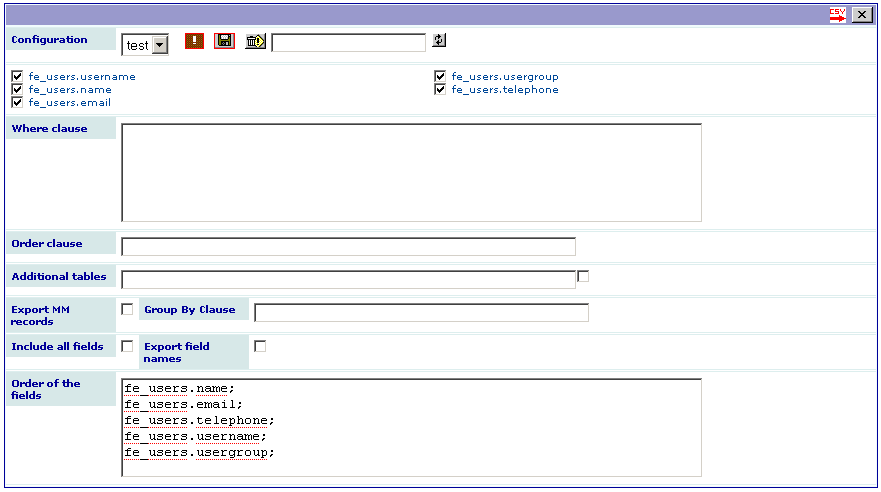

.. include:: ../Includes.txt

.. _introduction:

============
Introduction
============

What Does it Do?
================

This extension was created with the `SAV Library Kickstarter <http://t
ypo3.org/extensions/repository/view/sav_library_kickstarter>`_ in
order to be used with the `SAV Library Plus
<http://typo3.org/extensions/repository/view/sav_library_plus>`_
extension.

The SAV Library Extension Kickstarter makes it possible to directly
build extensions  **without any PHP coding**, thanks to simple
configuration parameters.

The SAV Library Kickstarter includes:

- Creation of multiple views of the data,

- Frontend input of the data,

- Views with folders,

- Context Sensitive Help,

- Generation of emails,

- Generation of RTF files using database tags,

- Data export in CSV format,

- Many other features.

The aim of this extension is to show how an extension can be easily built 
from an existing table. It will also be explained how to export data in CSV 
from the extension. The example deals with the fe_users table from which we 
want to build two forms:

- The first one (USER) is for the authenticated user who wants to manage 
  his/her personal data.

- The second one (ADMIN) is for a FE Admin user who may manage all users 
  and export them.

.. important::

  For more information, please read the
  :ref:`Tutorial 8 section of the SAV Library Plus documentation <savlibraryplus:tutorial8>`.

Screenshots
===========

User List View
--------------

User Edit View
--------------

Admin List View With an Export Icon
-----------------------------------

Admin Export View
-----------------

