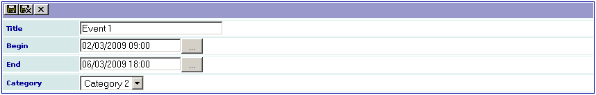
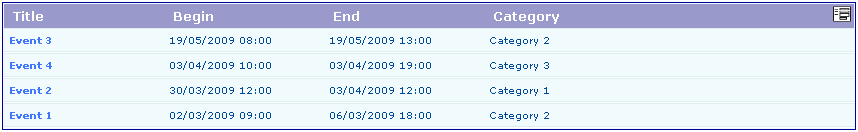

.. ==================================================
.. FOR YOUR INFORMATION
.. --------------------------------------------------
.. -*- coding: utf-8 -*- with BOM.

.. ==================================================
.. DEFINE SOME TEXTROLES
.. --------------------------------------------------
.. role::   underline
.. role::   typoscript(code)
.. role::   ts(typoscript)
   :class:  typoscript
.. role::   php(code)

Introduction
============

What does it do?
----------------

This extension was created with the `SAV Library Kickstarter <http://t
ypo3.org/extensions/repository/view/sav_library_kickstarter>`_ in
order to be used with the `SAV Library Plus
<http://typo3.org/extensions/repository/view/sav_library_plus>`_
extension.

The SAV Library Extension Kickstarter makes it possible to directly
build extensions  **without any PHP coding**, thanks to simple
configuration parameters.

The SAV Library Kickstarter includes:

- Creation of multiple views of the data,

- Front end input of the data,

- Views with folders,

- Context Sensitive Help,

- Generation of emails,

- Generation of RTF files using database tags,

- Data export in CSV format,

- Many other features.

The aim of this extension is to show how include XML JpGraph into 
an extension (see the extension `sav_jpgraph <http://typo3.org/extensions
/repository/view/sav_jpgraph>`_ for  detailed information and a tutorial). 
In this example, we want to display list of events as Gantt graphs. 
Each graph is a period of time as, for example months or quarters. 
Two forms are requested:
The first one (Admin) will be used to input events in FE. An event includes 
a title, a begin and a end date, a category. Categories will be input in BE. 
They have a name and a color which will be used in the Gantt graph.

.. important::

  For more information, please read the
  :ref:`Tutorial 9 section of the SAV Library Plus documentation <savlibraryplus:tutorial9>`.

Screenshots
-----------

Admin Edit and List Views
^^^^^^^^^^^^^^^^^^^^^^^^^

List View
^^^^^^^^^
.. figure:: ../Images/ScreenshotsListView.png
