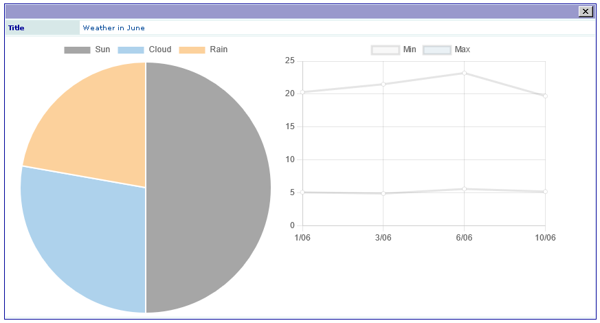
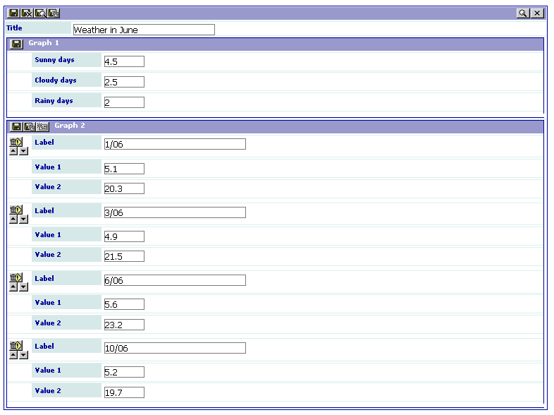

.. include:: ../Includes.txt

.. _introduction:

============
Introduction
============

What Does it Do?
================

This extension was created with the `SAV Library Kickstarter <http://t
ypo3.org/extensions/repository/view/sav_library_kickstarter>`_ in
order to be used with the `SAV Library Plus
<http://typo3.org/extensions/repository/view/sav_library_plus>`_
extension.

The SAV Library Extension Kickstarter makes it possible to directly
build extensions  **without any PHP coding**, thanks to simple
configuration parameters.

The SAV Library Kickstarter includes:

- Creation of multiple views of the data,

- Frontend input of the data,

- Views with folders,

- Context Sensitive Help,

- Generation of emails,

- Generation of RTF files using database tags,

- Data export in CSV format,

- Many other features.

The aim of this extension is to show how include charts into 
an extension (see the extension `sav_charts <https://extensions.typo3.org/extension/sav_charts>`_ for  detailed information and a tutorial). 

.. important::

  For more information, please read the
  :ref:`Tutorial 9 section of the SAV Library Plus documentation <yolftypo3/sav-library-plus:tutorial9>`.

Screenshots
===========

Single View
-----------

Edit View
---------

