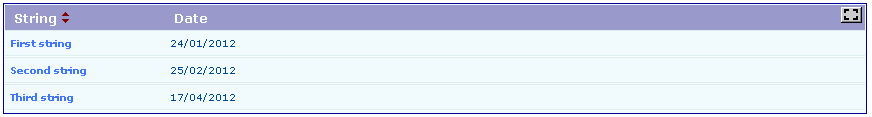
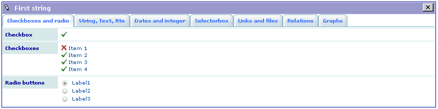
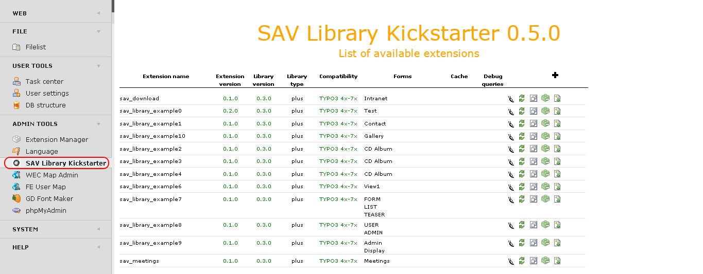
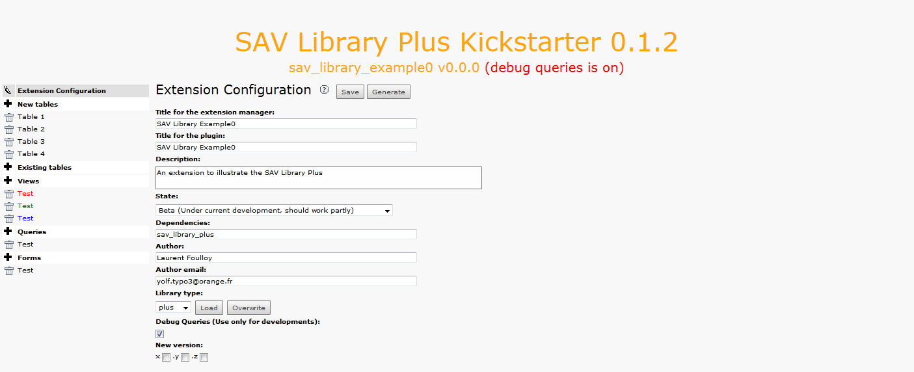
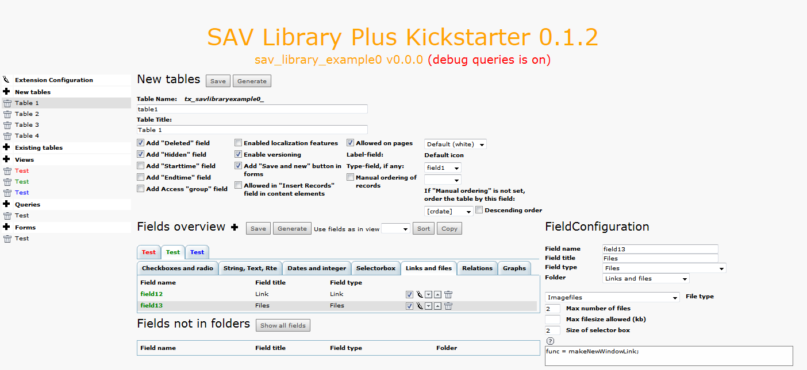
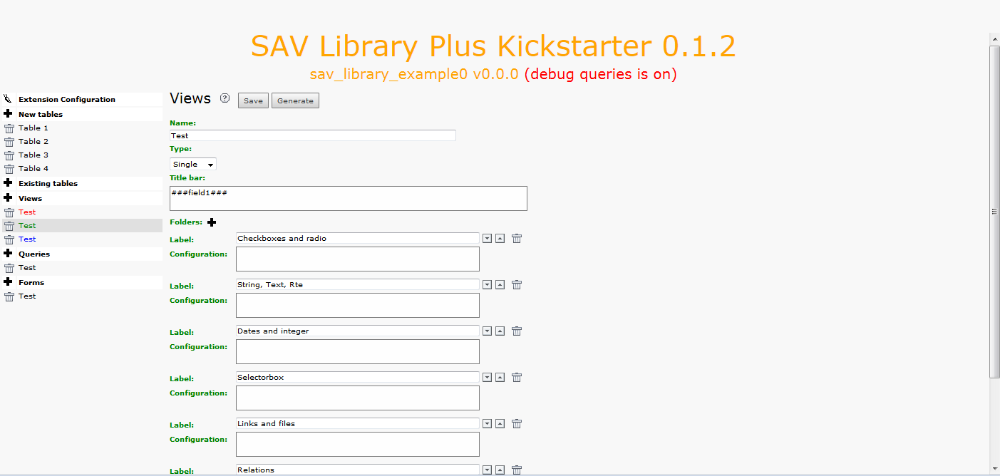
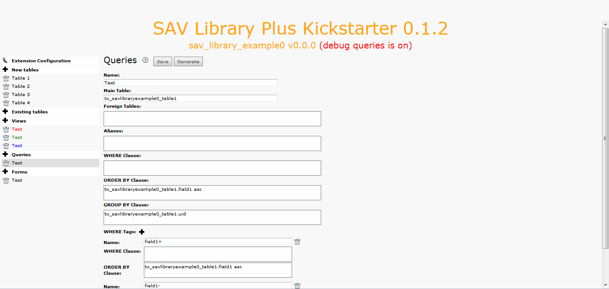
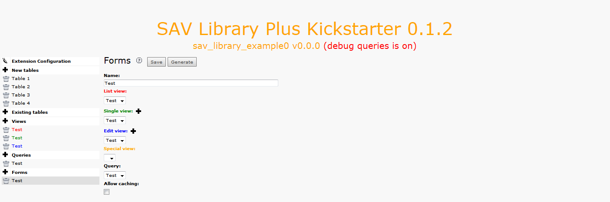

.. include:: ../Includes.txt

.. _introduction:

============
Introduction
============

What Does it Do?
================

The `SAV Library Kickstarter <https://typo3.org/extensions/repository/view/sav_library_kickstarter>`_ 
is a code generator, developed with extbase and fluid, to produce Frontend plugins.

Basic Code Generation
---------------------

This new feature was introduced in version 1.0.0 to kickstart extensions
based on fluid and extbase.

Code Generation for the SAV Library Plus
----------------------------------------

The `SAV Library Plus Extension
<https://typo3.org/extensions/repository/view/sav_library_plus>`_ is stable since many years. 
It makes it possible to develop extensions **without any
PHP coding**, thanks to simple configuration parameters.
The SAV Library Plus extension relies on a conventional approach for the
queries but uses fluid for the rendering of views.

The concept used in the SAV Library Plus relies on forms. A form is a
way of presenting data. It includes **List** view, **Single** view or **Edit**
views of the data. An extension may contain several forms. The
generator handles also special views like print views or update views.
Data presentation may differ from one view to another. A query is
associated with each form. Therefore, when several forms are used in
an extension, data may be different.

The SAV Library Kickstarter generates extensions which include:

- Creation of multiple views of the data,

- Frontend input of the data,

- Views with folders,

- Simple interface in the Kickstarter with Context Sensitive Helps,

- Generation of emails,

- Generation of RTF files using database tags,

- Data export in the CSV format or more complex format by means of XSLT
  processing,
  
- Management of different versions of the same extension,

- Many other features.

Code Generation for the SAV Library Mvc
---------------------------------------

The `SAV Library Mvc Extension <https://typo3.org/extensions/repository/view/sav_library_mvc>`_ is the new 
development of the SAV Library which fully relies on the MVC approach
with extbase and fluid. The configuration parameters to develop extension **without any
PHP coding** are the same as in SAV Library Plus.

This library is in beta state because it does not implement yet all the features available with SAV Library Plus. 
However available features are enough for most extensions.

Latest Developments
====================

The latest developments of the `SAV Library Kickstarter Project
<https://github.com/YolfTypo3/SavLibraryKickstarterProject>`_ 
are available on GitHub.

Test Extensions
===============

The extension `SAV Basic Example0
<https://typo3.org/extensions/repository/view/sav_basic_example0>`_
was designed to test the SAV Library Kickstarter generation for a basic extension with Fluid and Extbase.

The extension `SAV Library Example0
<https://typo3.org/extensions/repository/view/sav_library_example0>`_
was designed to test the SAV Library Kickstarter generation for the SAV Library
Plus extension. 

The extension `SAV Library Mvc Example0
<https://typo3.org/extensions/repository/view/sav_librarymvc_example0>`_
was designed to test the SAV Library Kickstarter generation for the SAV Library
Mvc extension. It implements the same features as SAV Library Example0.

Other Extensions in Relation with the SAV Library Kickstarter Project
=====================================================================

Extensions Generated for SAV Library Plus
-----------------------------------------

- SAV Library Example1
- SAV Library Example2
- SAV Library Example3
- SAV Library Example4
- SAV Library Example6
- SAV Library Example7
- SAV Library Example8
- SAV Library Example9 - this extension depends on sav_jpgraph and is now obsolete.
- SAV Library Example10 - this extension depends on wec_map.
- SAV Download
- SAV Meetings
    
Filters for SAV Library Plus
----------------------------

- SAV Filters

Extensions Generated for SAV Library Mvc
----------------------------------------

- SAV Calendar Mvc

Filters for SAV Library Plus
----------------------------    
    
- SAV Filter MVC

Extensions Generated as Basic Extensions
----------------------------------------

The following extensions have been kickstarted with the basic type.

- SAV Charts
- SAV Networks
    
.. warning::

   - Do not forget to include the **SAV Library Kickstarter static template** which is now required. 
   
.. important::
   
   - The compatibility with TYPO3 7.6 was removed in SAV Library Kickstarter 9.5.0.

Screenshots
===========

SAV Library Example0: Generated List View
-----------------------------------------

SAV Library Example0: Generated Single View
-------------------------------------------

SAV Library Example0: Generated Edit View
-----------------------------------------

.. figure:: ../Images/ScreenshotsExample0EditView.png

Kickstarter: Extension List
---------------------------

Kickstarter: Extension Configuration Section
----------------------------------------------

Kickstarter: New Tables Section
---------------------------------

Kickstarter: Views Section
----------------------------

Kickstarter: Queries Section
------------------------------

Kickstarter: Forms Section
----------------------------

