.. ==================================================
.. FOR YOUR INFORMATION
.. --------------------------------------------------
.. -*- coding: utf-8 -*- with BOM.

.. ==================================================
.. DEFINE SOME TEXTROLES
.. --------------------------------------------------
.. role::   underline
.. role::   typoscript(code)
.. role::   ts(typoscript)
   :class:  typoscript
.. role::   php(code)

Generating extensions for SAV Library Plus or SAV Libray Mvc
------------------------------------------------------------

In the following, this tutorial details the first steps used to create from scratch the extension "sav\_library\_example0".

.. warning::
   Do not forget to provide a **vendor name** which will be used in namespaces 
   (see https://docs.typo3.org/typo3cms/CoreApiReference/ApiOverview/Namespaces/Index.html).
   
.. important::
   Since the Library Type is set to "Plus" this test extension requires the SAV Library Plus extension to be downloaded from the TER and installed. 

.. caution::
   If you want to test the extension with the SAV Library Mvc, set the Library type to "Mvc", download the SAV Livbrary Mvc 
   from the TER and install it. 

.. tip::
   Test extensions implementing many features are available in the TER:
   
   - `sav_library_example0 <https://typo3.org/extensions/repository/view/sav_library_example0>`_ to be used with SAV Library Plus.

   - `sav_librarymvc_example0 <https://typo3.org/extensions/repository/view/sav_librarymvc_example0>`_ to be used with SAV Library Mvc.

Fill the form and click on the "Save" button.   
  
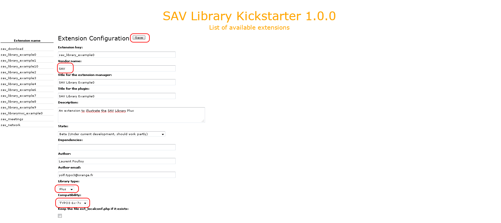

The version 0.0.0 of the extension “sav\_library\_example0” is now
created and a redirection to the “Extension Configuration” form.
A menu is available on the left hand side.

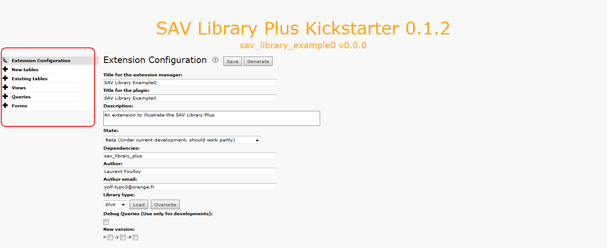

Two types of menu item are displayed : menu items with edit icon
(paintbrush icon) and menu items with new icon (cross icon). The
former opens directly the requested item either by clicking on the
icon or the title (e.g. “Extension Configuration”). The latter creates
a sub-item by clicking on the icon. By default, the sub-item title is
“New”.

Click on the cross icon of the "New tables" section, enter a name and a title for
the table, change the flags if necessary and  **save**.

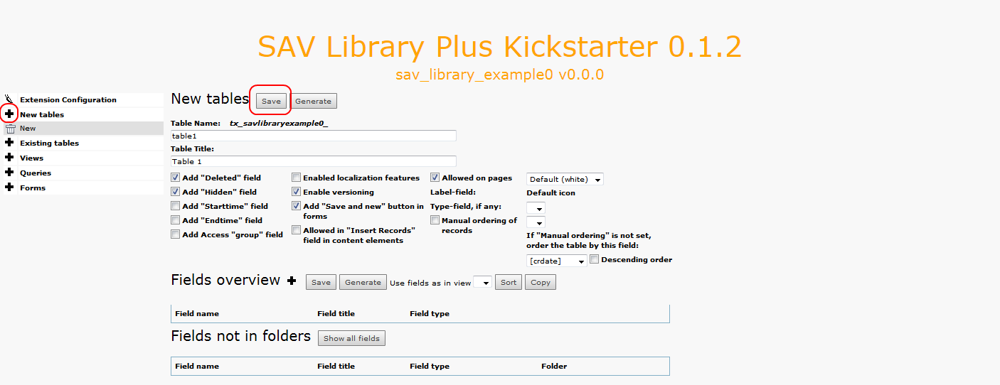

Add the table fields by clicking on the cross icon at the right of the
fields overview. By default, the field name and title are set to
“New”.

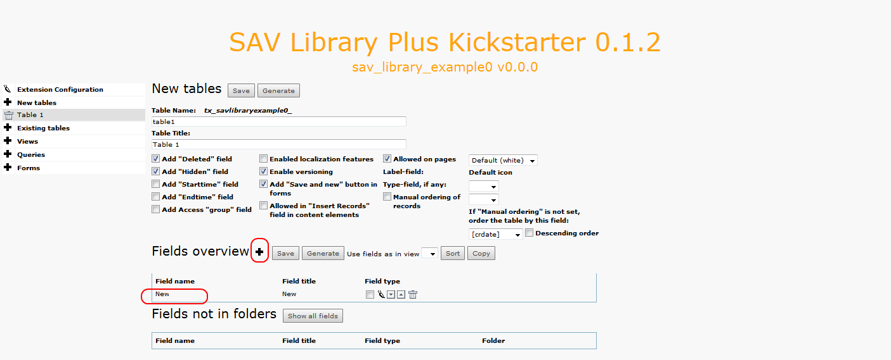

If you have several field, in order to fasten the process, you may
click several times on cross icon to add the fields. Each field can be
selected ,edited, moved up or down and deleted using the icons.

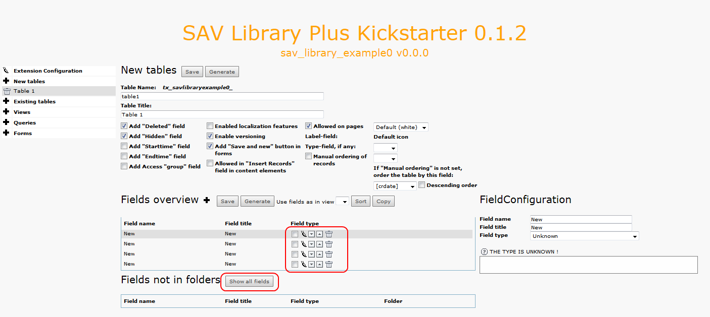

Click on the “Show all fields” button to set the field names, titles and
types, then  **save** .

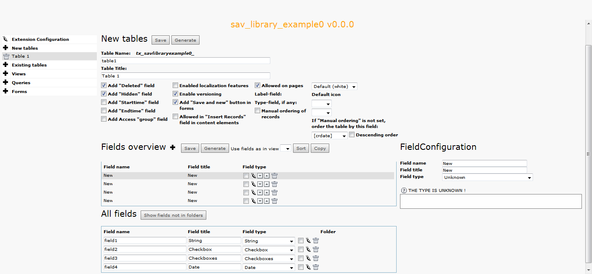

To create the views, click on the new icon of the “Views” menu item.
Provide a name and select the type of the view (List, Single, Edit,
Special) and  **save** .

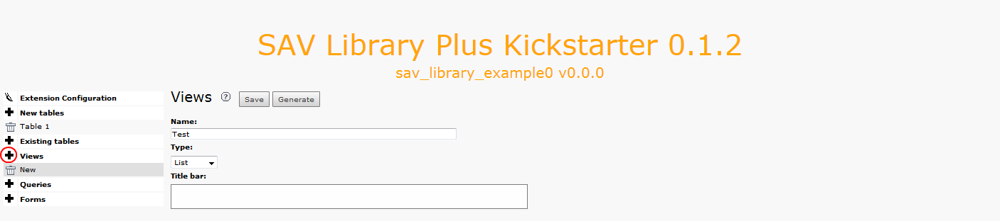

After saving, displayed information will depend on the selected type.
In general, three views are required for one form. A list view, a
single view and an edit view. For the list view, an item template is
required. It contains the HTML code which will be used to display each
item of the list. Markers will be replaced by their values.

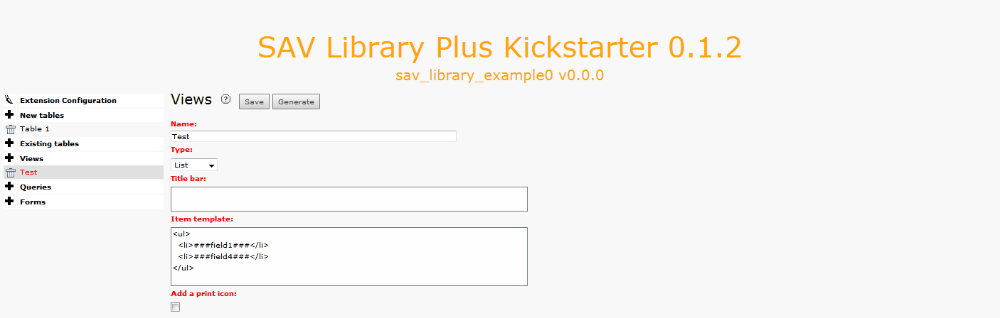

Do the same for the single and edit view. You can use the same name
for your view since colors are used to differentiate between them.
Single and edit views may contain folders to present the data as
explained later. In this example, two folders are introduced in the
single view. Click on the new folder icon to add a folder. Each folder
can be moved up, moved down or deleted using the icons at the right
hand side of the label definition.

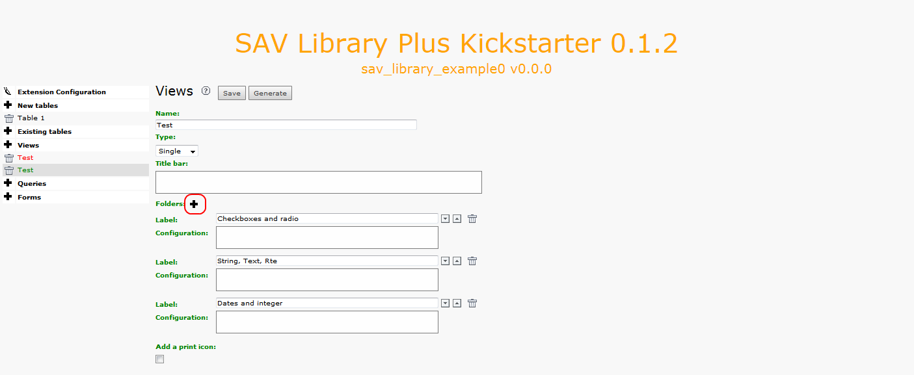

Now, create a new query. Replace the default name and save. Once
again, you may use the same name as for the views. By default, the
main table will be set to the first table you have defined.

.. figure:: ../../Images/TutorialKickstarterAddingANewQuery.png

Create a new form, select the list, single, edit views and the query
and  **save** .

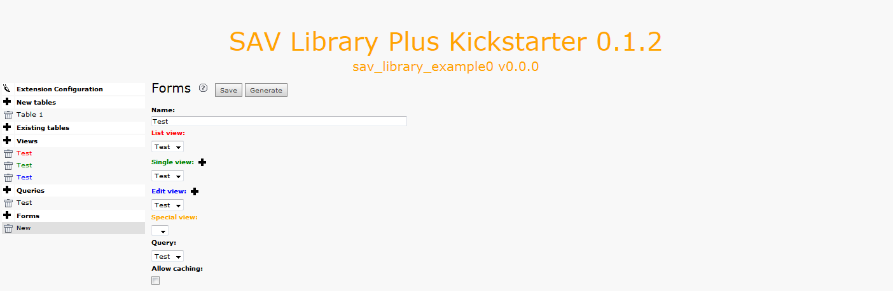

The last step is to define with fields should be displayed in the
views. Edit the table by clicking on “Table 1” in the left hand side
menu. In the fields overview section, each view is associated with a
folder tab. Select the fields that must be displayed using the
checkbox and  **save** . For the list view, the items associated with
the markers used in the item template must be selected. Save the
selection. The selected items are displayed in the color of the view,
that is in red for the list view.

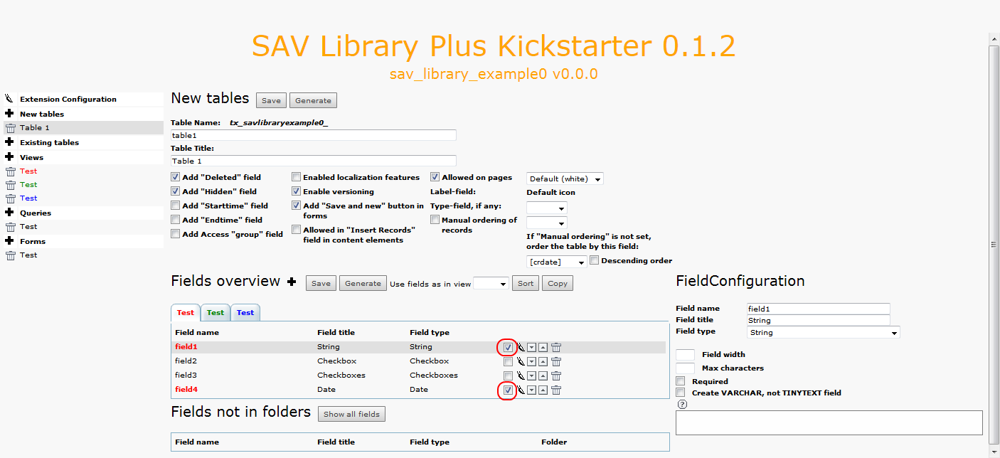

Click on the green folder tab to select the single view. Select the
fields you want to display and their associated folder if any the
**save** .

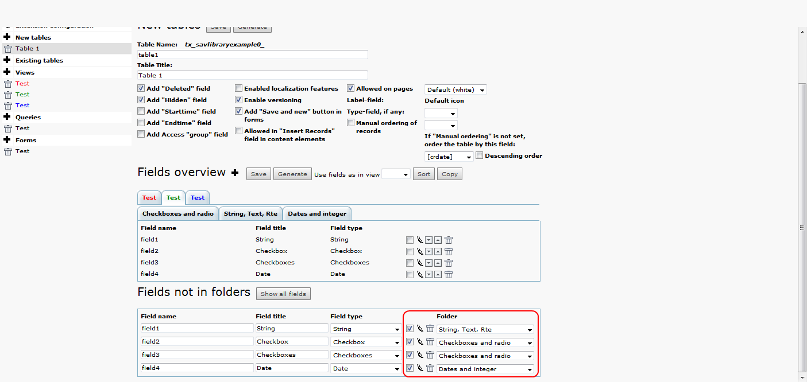

By clicking on a folder, you will see the fields in it which can be
edited, moved up and down or deleted.

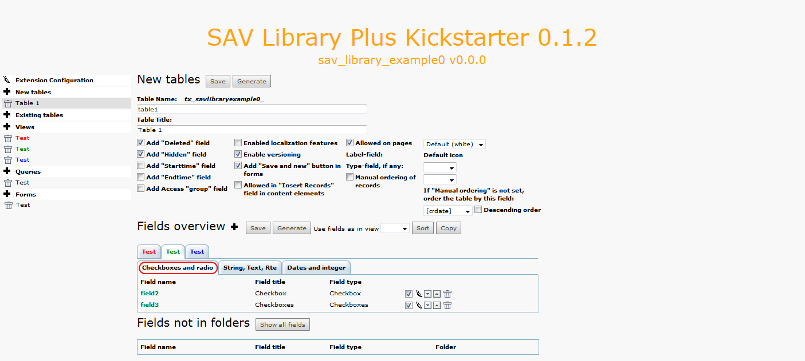

Let us note that if you click on the field name, it gives access to
the field configuration as shown below. In this example, “field2” will
be displayed.

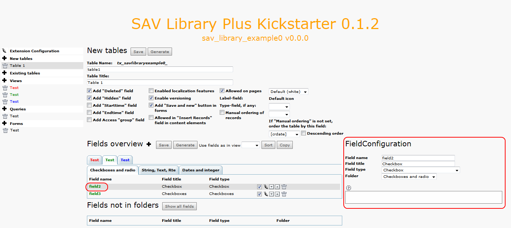

Add labels for the each checkbox in field3 by clicking on the cross
icon as shown below. It is easier to first add the label fields by
clicking three times on the cross icon and then to fill them before
saving.

.. figure:: ../../Images/TutorialKickstarterField3FieldConfiguration.png

Now click on the blue folder tab to select the edit view. Select the
field you want to display. Let us recall that there is no folder
associated with this view.

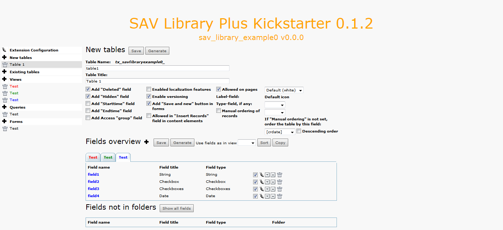

The final step is to generate the extension by clicking on the
“Generate” button. After the processing, the SQL statement to create
the table is displayed. Click on “Make updates” to complete the
generation of the extension.

.. figure:: ../../Images/TutorialKickstarterSQL.png

Installing the extension
^^^^^^^^^^^^^^^^^^^^^^^^

Click on the “SAV Kickstarter” item in the “Admin tools” menu to
display the extension list and click on the “Install” icon as shown
below to install it.

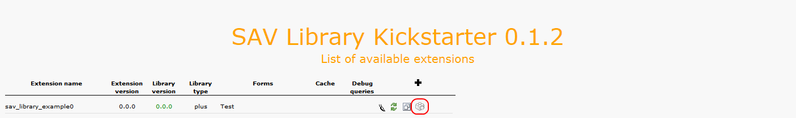

Create a page and insert a plugin content element and select “SAV
Library Example0” in the plugin selector.

The configuration of the plugin is performed by means of a flexform
which comes with default values. Just select your form name, that is
“Test” in the “Select form” selector, save your content element and
clear the cache.

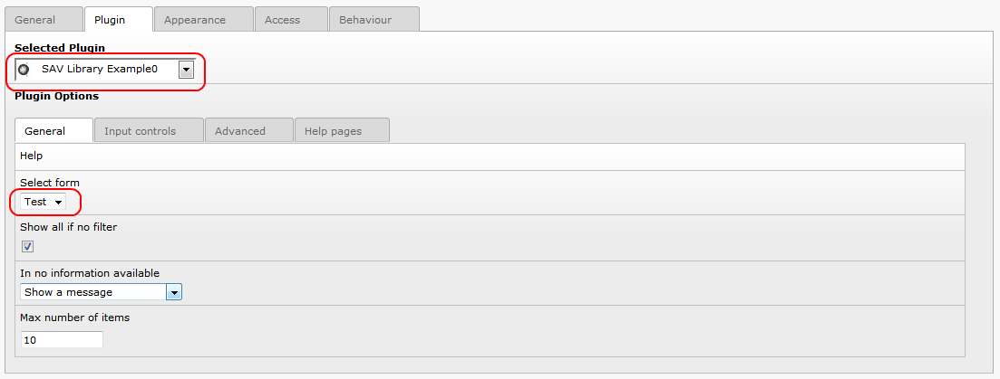

Go to your page in Front End and you should see the following caption.

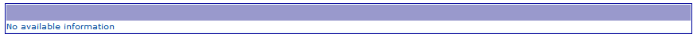

Now, log yourself as a frontend user and reload your page. You should
now see the toggle icon to enter in edit mode. Click on it.

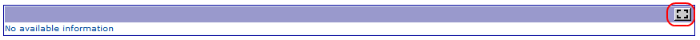

A new icon appears at the left hand side of the form. Click on it to
add a new item.

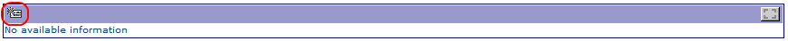

Input the data and save using the icons in the title bar.

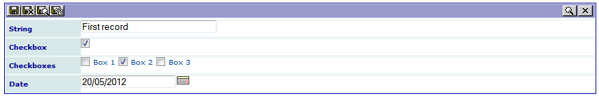

For example, if you click on the “Save and close” icon, you will be
redirected to the list view, where the two fields (field1 and field4)
are displayed according to the template item. You can add a new
record, edit or delete the previous one or leave the edit mode by
clicking on the different icons.

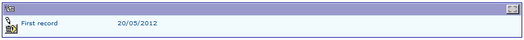

Generally, you will want to display the single view associated with a
given item by clicking on a link. Let us assume that, in our example,
this link should be “First record” in the previous caption. This will
be done with a simple configuration associated with “field1” in the
list view.

Edit the extension with the SAV Library Kickstarter, click on the
“Table 1” item, select the list view and click on “field1”. In the
configuration text area, type “func = makeItemLink;”, then click on
“Generate”.

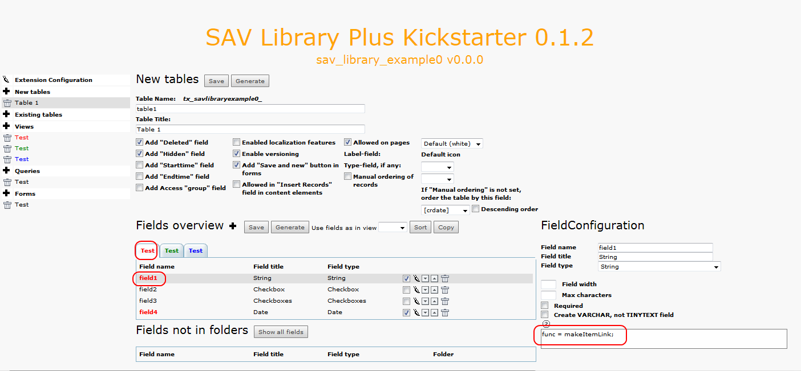

Go in the Front End and reload your page. Now, a link is associated
with “First record”. The “enter in edit mode” icon will be displayed
as long as you are logged as a Front End user.

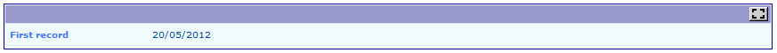

Click on the link to open the single view. As you can see, the items
are organized with our three folder tabs. The “edit” icon on the left
hand side will be displayed as long as you are logged as a Front End
user. By clicking on it, you will enter in the edit view.

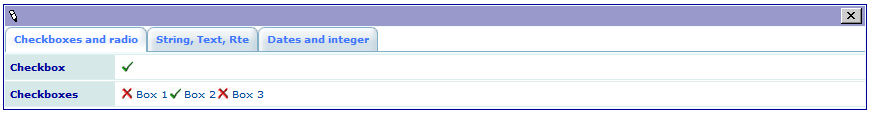

Click on a folder tab to change the view.

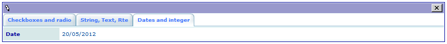

More information
^^^^^^^^^^^^^^^^

Please read the reference section for the field configuration
(remember that a context sensitive help is also available for each
field in the SAV Library Kickstarter).

The tutorials section in the SAV Library Plus documentation provides
also several examples.

