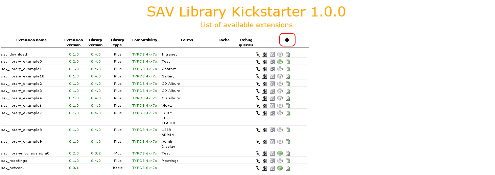
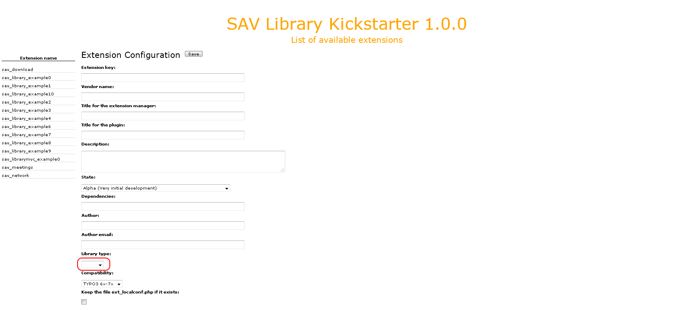

.. ==================================================
.. FOR YOUR INFORMATION
.. --------------------------------------------------
.. -*- coding: utf-8 -*- with BOM.

.. ==================================================
.. DEFINE SOME TEXTROLES
.. --------------------------------------------------
.. role::   underline
.. role::   typoscript(code)
.. role::   ts(typoscript)
   :class:  typoscript
.. role::   php(code)

.. _tutorial:

Tutorial
========

The aim of this tutorial is to show how to use the SAV Library
Kickstarter.

Creating the extension
----------------------

If you have neither created any extension with the SAV Library
Kickstarter nor having SAV Library extensions uploaded, you will
obtain the following display.

If you have already created extensions with the SAV Library
Kickstarter or uploaded SAV Library extensions, they will be displayed.

To create a new extension, click on the "Create a new extension" icon
as shown below.

A new form will be displayed. If your have already created extensions, there
name are displayed on the left hand side.

Three library types are available:

- **Plus** -  The SAV Library Kickstarter generates an extension which requires
  the SAV Library Plus to be loaded.
  The `SAV Library Plus Extension
  <http://typo3.org/extensions/repository/view/sav_library_plus>`_ is stable since many years. 
  It makes it possible to develop extensions **without any
  PHP coding**, thanks to simple configuration parameters.
  The SAV Library Plus extension relies on a conventional approach for the
  queries but uses fluid for the rendering of views.

- **Mvc** - The SAV Library Kickstarter generates an extension which requires
  the SAV Library Mvc to be loaded.
  The `SAV Library Mvc Extension <http://typo3.org/extensions/repository/view/sav_library_mvc>`_ is the new 
  development of the SAV Library which fully relies on the MVC approach
  with extbase and fluid. The configuration parameters to develop extension **without any
  PHP coding** are the same as in SAV Library Plus. This library is in beta state because it does not implement yet all 
  the features available with SAV Library Plus. However available features are enough for most extensions.

- **Basic** - This new feature was introduced in version 1.0.0 to **kickstart extensions
  based on extbase and fluid**.
  This basic generation includes the database, models, repositories and TCA generation for all the types available 
  when using the SAV Library Plus or SAV Library Mvc. The controller displays a very basic template.

Table of Contents
-----------------
 
.. toctree::
   :maxdepth: 5
   :titlesonly:
   :glob:

   GenerateExtensionsForSavLibraryPlusOrMvc/Index
   KickstartExtensionsForExtbaseFluid/Index  

