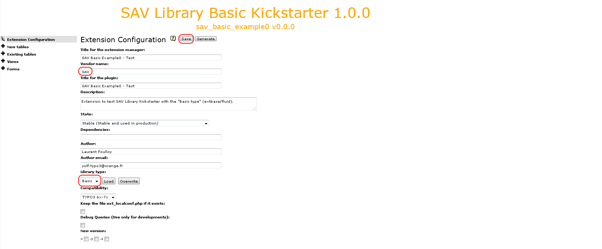
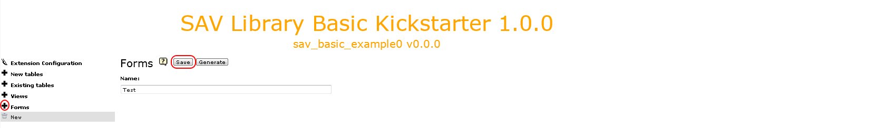
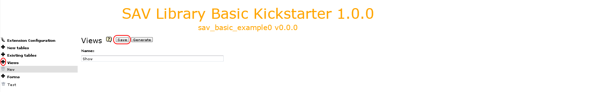
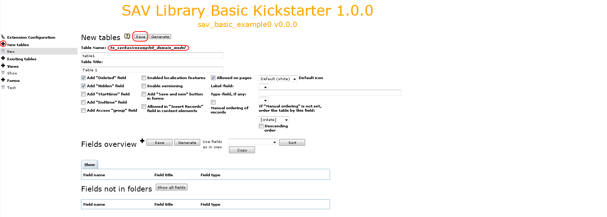
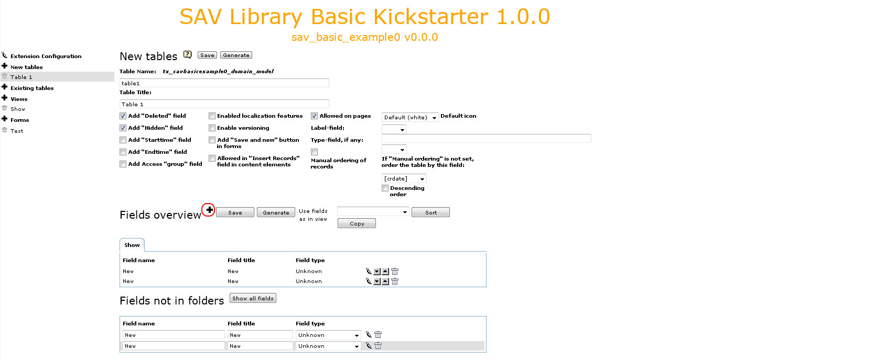
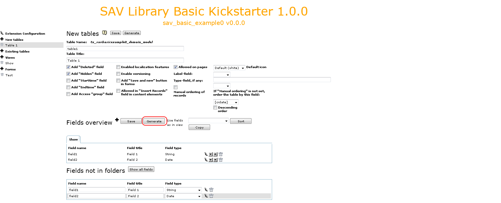
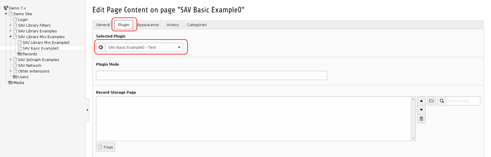
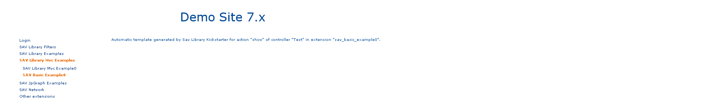

.. ==================================================
.. FOR YOUR INFORMATION
.. --------------------------------------------------
.. -*- coding: utf-8 -*- with BOM.

.. ==================================================
.. DEFINE SOME TEXTROLES
.. --------------------------------------------------
.. role::   underline
.. role::   typoscript(code)
.. role::   ts(typoscript)
   :class:  typoscript
.. role::   php(code)

Kickstarting extensions for extbase/fluid
-----------------------------------------

Fill the form and click on the "Save" button.   
  

.. warning::
   Do not forget to provide a **vendor name** which will be used in namespaces 
   (see https://docs.typo3.org/typo3cms/CoreApiReference/ApiOverview/Namespaces/Index.html).
   
Click on the cross icon of the “Forms” section, enter a name and **save**. The form name will be the extbase **controller name**.

   
Click on the cross icon of the “Views” section, enter a name and **save**. The view name will be the **default action name**.
   

Click on the cross icon of the "New tables" section, enter a short name and a title for
the table, change the flags if necessary and **save**.

.. warning::
   Provide only a short name for the table. It will be added to the default 
   part (here tx_savbasicexample0_domain_model) to build the full name.

Add the table fields by clicking on the cross icon at the right of the
fields overview. By default, the field name and title are set to
“New”.

.. tip::
   if you have several field, in order to fasten the process, you may
   click several times on cross icon to add the fields. 

Each field can be edited, moved up or down and deleted using the icons. Provide
a field name (name in the database), a label and a type. The kickstarter will 
generates the TCA for conventional useful types. **Do not forget to save**.

The final step is to generate the extension by clicking on the "Generte" button.

Installing the extension
^^^^^^^^^^^^^^^^^^^^^^^^

Install you extension either with the extension manager or with SAV Library Kickstarer

Create a page and insert a plugin content element and select “SAV
Basic Example0” in the plugin selector.

Go to your page in Front End and you should see the following caption.

