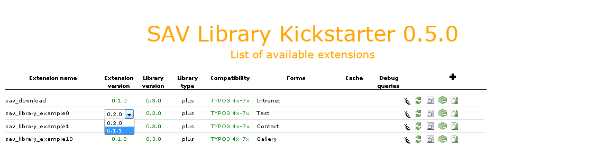
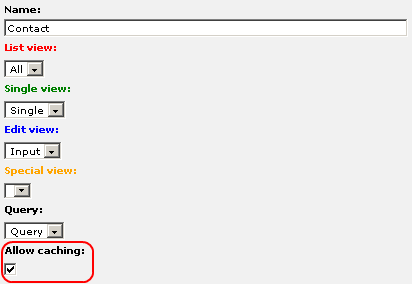

.. include:: ../Includes.txt

.. _usersManual:

============
Users manual
============

Installation
============

- Download the extension “sav\_library\_kickstarter” and install it.

.. warning::

   - Do not forget to include the SAV Library Kickstarter static template which is now required.
    
.. important::

   - If you are not familiar with the SAV Library Kickstarter, read the
     tutorial section of this manual first.

Updating Previously Generated Extensions
========================================

The SAV Library Kickstarter comes with an upgrade feature which will
upgrade your extensions to the most recent version. When the SAV
Library version used for the extension generation is not the same as
the installed SAV Library version, the following display will be
obtained. Since Version 0.2.0 of the SAV Library Kickstarter a global
upgrade icon was added which upgrades extensions 10 by 10.

.. figure:: ../Images/UsersManualUpgradingExtension.png 

Click on the upgrade icon on the same line as the extension name to
upgrade it to the latest version of the code generator or click on the
icon at the right of the **plus** icon to upgrade all extensions that
need to be upgraded. Once upgraded, the upgrade icons will disappear
and the library version will be displayed in green as shown below.

.. figure:: ../Images/UsersManualExtensionUpgraded.png  

For each extension in this list, several information are displayed:

- The name of the extension, that is the extension key. By clicking on
  the name, you will be able to edit the extension.

- The current version of the extension.

- The version of the SAV Library which has been used to generate the
  extension. If the version of the SAV Library is older than the
  installed version, the version will be displayed in red and the
  upgrade button will be displayed. In that case, please upgrade the
  extension by clicking on the upgrade icon.

- The library type which indicates the required library type for the
  extension. “Plus” is the default.

- The list of the forms used in the extension since one extension may
  contain several forms. For each form you can select if the plugin will
  behave as a USER for this form, that is caching will be possible. By
  default, the plugin will behave as a USER\_INT for all forms, that is
  no caching is available. If you want to make a form behaving as a
  USER, edit the form section associated with your extension and check
  the “Allow caching” flag.

- The debug queries flag which indicates whether you have set this flag
  in the extension configuration view. This flag should only be used
  during development.

- A set of icons is also displayed. From left to right their respective
  actions are : edit the extension, generate the extension, copy the
  extension and instal/uninstall the extension.

Managing Extension Versions
===========================

Management of extension versions was introduced in version 0.5.0 of 
the SAV Library Kickstarter. In the extension list, clicking on the extension 
version leads to a selector box with the available extension versions as shown below.
Select the version you want to work with and it will be loaded. 

.. important:: 
   If your extensions were generated with a version of the SAV Library Kickstater
   lower than 0.5.0, please regenerate your extension to make this feature available.

.. important::    
   The extension used by the SAV Library is always the last generated one.
   When the extension in use is not the latest version, the 
   extension version is displayed in red in the extension list as shown below.

   .. figure:: ../Images/UsersManualManagingExtensionVersionsNotTheLatest.png   

Creating a New Extension
========================

See the tutorial section for more details.

Copying an Extension
====================

The kickstarter has a copy feature to duplicate extensions. Click on
the copy icon as shown below.

.. figure:: ../Images/UsersManualCopyingAnExtension.png

Enter the new extension key and click on the “Save” button. That's it
!

.. figure:: ../Images/UsersManualNewExtensionName.png

.. figure:: ../Images/UsersManualExtensionCopied.png

Caching
=======
   
The plugin behaviour may be changed for each form. By default, the
plugin runs as USER\_INT for each form, that is no caching is
performed. By selecting the checkbox “Allow caching” in the “Forms”
section of the Kickstarter, the plugin will run as USER for this form.
It means that caching will be set. A “cHash” parameter is added to
each item links used to access to the “Single” view associated with
the item.

When the plugin is running as USER (caching enabled) and an item is
updated in the “Edit” view, the cache of the current page is cleared
on saving so that updated information could be displayed.