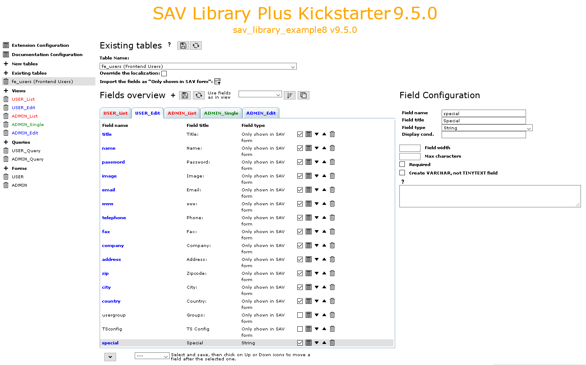

.. include:: ../../../Includes.txt

.. _kickstarterMenu.existingTables:

===============
Existing Tables
===============

This item opens the form used to generate the existing tables 
of the extension.

.. tip::
   
   Click on the icons at the right hand side of **New Tables**:
   
   - to access to this section of the documentation.
   - to save the configuration
   - to generate the extension.
   
The **Existing Tables** form has three different sections:

- the table configuration.
- the fields overview.
- the field configuration.

.. _kickstarterMenu.existingTables.tableConfiguration:

Table Configuration
===================

The table configuration consists simply in selecting an existing
table with the selector and then importing all its fields using
the import icon. Fields are imported with the :ref:`Show Only type <showOnly>`.
See the extension `sav_library_example8 
<https://extensions.typo3.org/extension/sav_library_example8>`_ for an example.

.. figure:: ../../../Images/UsersManualKickstarterMenuExistingTablesTableConfiguration.png 

Fields Overview and Field Configuration
=======================================

You can execute exactly the same action as with a :ref:`new table 
<kickstarterMenu.newTables.fieldsOverview>`, including adding 
new fields to an existing table.
