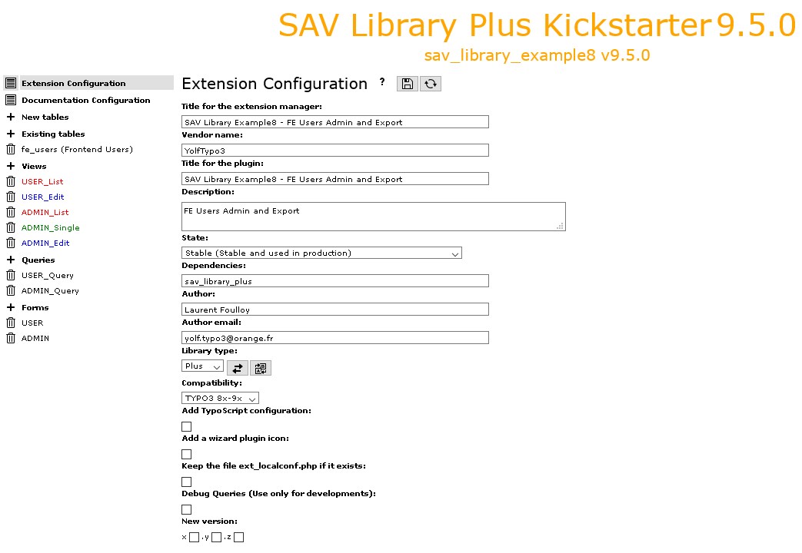

.. include:: ../../../Includes.txt

.. _kickstarterMenu.extensionConfiguration:

=======================
Extension Configuration
=======================

This item opens the form for the configuration of the extension.

.. tip::
   
   Click on the icons at the right hand side of **Extension Configuration**:
   
   - to access to this section of the documentation.
   - to save your configuration
   - to generate the extension.

- **Title for the extension manager**: title which will be displayed in 
  extension manager.
  
- **Vendor name**: vendor name (**mandatory**).

- **Title for the plugin**: title which will be displayed in the 
  plugin selector. 
  
- **Description**: use this field to describe the aim of the 
  extension. 
  
- **State**: selector which specifies the state of the extension.

- **Dependencies**: specify here the dependencies of the extension.

  The SAV Library Kickstarter generates automatically the dependency
  to SAV Library Plus or SAV Library Mvc.
  
- **Author**: use this field to set the extension's author.   

- **Author email**: use this field to set the author's email.

- **Library type**: selector which specifies the type of extension
  which will be generated. The **Basic** type can be used to kickstart
  extension using Fluid and Exbase. Icons at the right hand side of
  the selector are still experimental. They should make it possible
  to migrate a **Plus** type extension to a **Mvc** type extension 
  and vice-versa.
  
- **Compatibility**: selector which defines the compatibility of the
  extension. This selector evolves with the version of TYPO3. If an extension
  becomes incompatible, it has to be upgraded. 

- **Add TypoScript configuration**: if selected, TypoScript configuration files are
  added (only for **Plus** type. For **Basic** and **Mvc** TypoScript configuration files are
  always added.

- **Add a wizard plugin icon**: if selected, a wizard icon will be added to the plugin.
  The wizard icon file must be named **ExtensionWizard.svg** and 
  put in the directory **Resources/Public/Icons**.

- **Keep the file ext_localconf.php if it exists**: set this option 
  if you **manually** modify the **ext_localconf.php** file. 
  It will prevent the SAV Library Kickstarter to rebuild it.
  
- **Debug Queries (Use only for developments)**: set this option to display 
  error messages on queries, if any. The **Debug Query** option should not 
  be left in the final version of your extension for security reasons.
  
- **New version**: use these checkboxes to automatically ugrade the version of your extension.

  .. tip::
  
     - If you set z, one unit will be added to the z part.
     - It you set y, one unit will be added to the y part, while the z part is reset to 0.
     - If you set x, one unit, will be added to the x part, while the y and z parts will be reset.

