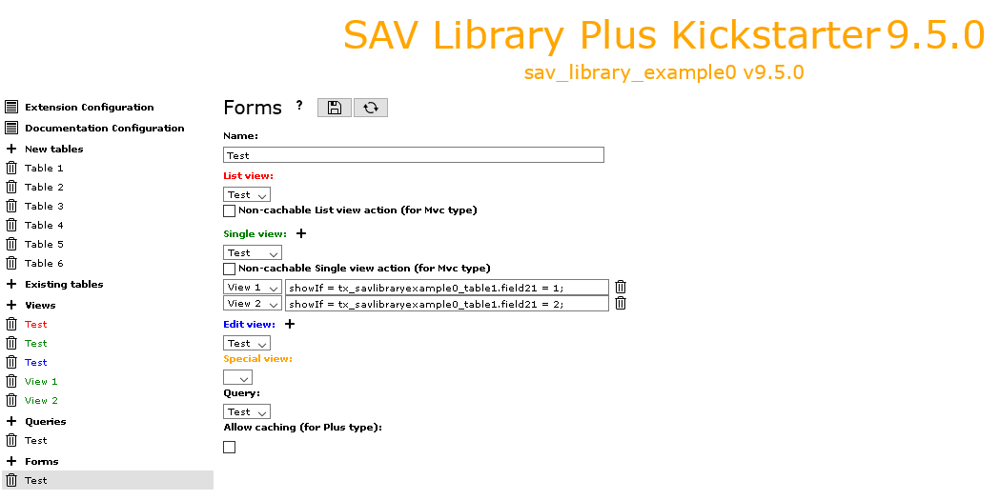

.. include:: ../../../Includes.txt

.. _kickstarterMenu.forms:

=====
Forms
=====

This item opens the form used to generate the forms of the extension.

.. tip::
   
   Click on the icons at the right hand side of **Forms**:
   
   - to access to this section of the documentation.
   - to save the configuration
   - to generate the extension.

- **Name**: sets the name of the form.

- **List view**: Use the selector to set the **List** view that should be used 
  with the form (if any).

- **Non-cachable List view action (for Mvc type)**: when using SAV Library Mvc, select 
  the checkbox if the **List** view must be non-cachable. 

- **Single view**: use the selector to set the **Single** view that should be used
  with the form (if any).

- **Non-cachable Single view action (for Mvc type)**: when using SAV Library Mvc, select 
  the checkbox if the **Single** view must be non-cachable. 
  
- **Single view with a condition field**: these fields are created by clicking
  on the **plus** icon at the right hand side of **Single view**. Provide a name
  and a condition for the view. See the extension `sav_library_example0 
  <https://extensions.typo3.org/extension/sav_library_example0>`_  for
  an example. 

- **Edit view**: use the selector to set the **Edit** view that should be 
  used with the form (if any).

- **Edit view with a condition field**: these fields are created by clicking
  on the **plus** icon at the right hand side of **Edit view**. Provide a name
  and a condition for the view. 
 
- **Special view**: use the selector to set the **Special** view that 
  should be used with the form (if any).
   
- **Query**: use the selector to set the **Query** that should be 
  used with the form.
  
- **Allow caching (for Plus type)**: select this checkbox if the 
  plugin should behave as USER for this form, that is caching is enabled
  for **List** and **Single** views when the SAV Library Plus (Plus type)
  is used. By default, the plugin will behave as USER_INT (no caching) for 
  all the forms.