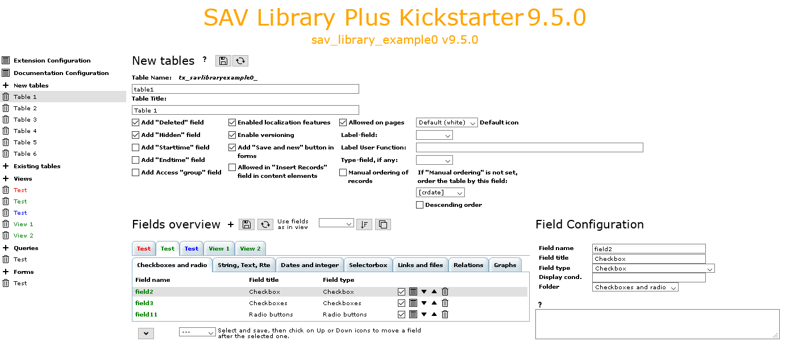
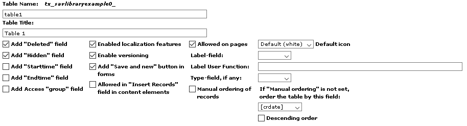
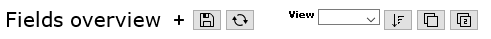
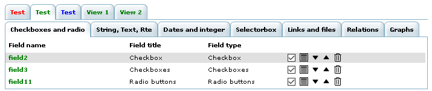
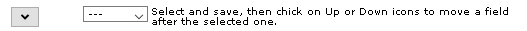
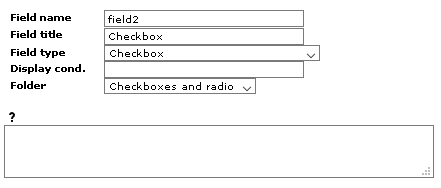

.. include:: ../../../Includes.txt

.. _kickstarterMenu.newTables:

==========
New Tables
==========

This item opens the form used to generate the new tables 
of the extension.

.. tip::
   
   Click on the icons at the right hand side of **New Tables**:
   
   - to access to this section of the documentation.
   - to save the configuration
   - to generate the extension.
   
The **New Tables** form has three different sections:

- the table configuration.
- the fields overview.
- the field configuration.

.. _kickstarterMenu.newTables.tableConfiguration:

Table Configuration
===================

This section contains several fields which have an impact on the behavior of the
extension.

- **Table Name**: enter in this field a short name for the table. 

  .. important::
  
     The SAV Library Kickstarter always prepend to the field **tx_yourextensioname** 
     for **Plus** type and **tx_yourextensioname_domain_model** for **Basic** and **Mvc**
     types.
     
     If your enter, for example, **shortname**, the real name in the database will be
     **tx_yourextensioname_shortname** for **Plus** type and 
     **tx_yourextensioname_domain_model_shortname** for **Basic** and **Mvc**
     types.
     
     For **Plus** type, if you leave this field empty, the real name in the database 
     for the table will be  **tx_yourextensioname**.

- **Table Title**: enter the table title which will appear in the backend.

- **Add "Deleted" field**: select the checkbox to add the field **deleted** to the table 
  in the database.
  
- **Add "Hidden" field**: select the checkbox to add the field **hidden** to the table 
  in the database.
  
- **Add "Starttime" field**: select the checkbox to add the field **starttime** to the table 
  in the database. 
  
- **Add "Endtime" field**: select the checkbox to add the field **endtime** tor the table 
  in the database.  
  
- **Add Access "group" field**: select the checkbox to add the field **fe_group** to the table 
  in the database.
  
- **Enabled localization features**: select the checkbox to add the fields for the localization
  of the record.
  
- **Enable versioning**: select the checkbox to add the fields for versionning of the record.

- **Add "Save and new" button in forms**: select the checkbox to add a **Save and New** button
  in **Edit** views.
  
- **Allowed in "Insert Records" field in content elements**: select this checkbox if you want
  to add the table to the list of tables allowed to be included by content element type 
  "Insert records".
 
- **Allowed on pages**: select this checkbox if you want to add the table to the
  default list of allowed tables on pages. Use the **default icon** selector to choose
  the color of the record icon in the backend.
  
- **Label-field**: use the selector to choose the field that will appear in the backend.
  By defaul the label will be the **uid**.      
  
- **Label User Function**: when a special labeling is needed in the backend, you may use a 
  `label_userFunc <https://docs.typo3.org/m/typo3/reference-tca/master/en-us/Ctrl
  /Index.html#ctrl-reference-label-userfunc>`_. 
  
- **Type-field, if any**: field name, which defines the "record type"(see `type <https://docs.typo3.org/m/typo3/
  reference-tca/master/en-us/Ctrl/Index.html#type>`_).

- **Manual ordering of records**: select this checkbox if you want to order manually the records.

- **If "Manual ordering" is not set, order the table by this field**: use this selector to order 
  the record by ascending order of the **Label-field** in the backend.
  
- **Descending order**: select this checkbox for a descending order.

.. _kickstarterMenu.newTables.fieldsOverview:

Fields Overview
===============   

The first part of the **Field overview** section controls several actions.

Icons at the right hand side of **Field Configuration** can be respectively used to:

- add a new field.
- save the configuration.
- generate the extension.
- sort the current view in the same order as the view in the selector **View**.
- copy the field configuration of the selected field from the view in the selector 
  **View** to the current view. 
- copy the fields configuration from the view in the selector 
  **View** to the current view.   

The second part of the **Field overview** section deals with the control of fields
which will be rendered in each view and each folder, if any for the view. You can 
select a view or a folder in a view, edit, move or delete fields.

The third part of the **Field overview** section provides extra fields control action.

- The first icon toogles the display of all fields, possibly in a folder if any.

- The selector can be used to move a field below another one.

.. _kickstarterMenu.newTables.fieldConfiguration:

Field Configuration
===================

This section is opened by clicking on a field name or an edit icon in the 
**Fields Overview** section.

- **Field name**: sets the name of the field in the database.

- **Field title**: sets label for the field.

- **Field type**: sets type of the field. 

- **Display cond.**: adds a `display condition <https://docs.typo3.org/m/
  typo3/reference-tca/master/en-us/Columns/Index.html#displaycond>`_. 

- **Folders**: sets the folder for the field, if any. 

Specific configuration options are added depending on the field type.

Enter configuration attributes for the field in the textarea. See the
:ref:`Reference section <reference>` of this manual for allowed attributes
for each type. 

.. tip:

   The help icon (the question mark icon just above the textarea) provides a direct
   link to the reference section for the selected field type.
