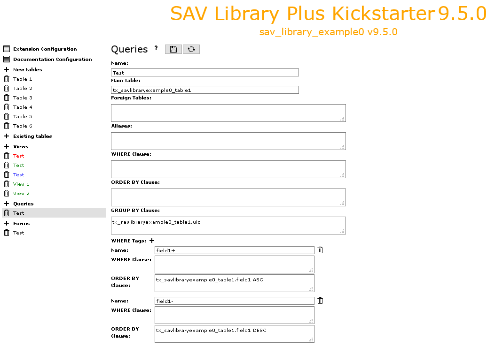

.. include:: ../../../Includes.txt

.. _kickstarterMenu.queries:

=======
Queries
=======

This item opens the form used to generate the queries of the extension.

.. tip::
   
   Click on the icons at the right hand side of **Queries**:
   
   - to access to this section of the documentation.
   - to save the configuration
   - to generate the extension.
   
- **Name**: sets the name of your query.

- **Main Table**: sets the main table that your extension will use. 
  By default, it is the first table in your **New tables** section.

- **Foreign Tables**: this field can be used to add foreign tables, 
  e.g. tables from other extension, that are needed for the extension. 
  It is possible to use **LEFT JOIN** ou **INNER JOIN** syntax.

- **Aliases**: use this field to define here the aliases associated 
  with the query (MySQL syntax).

- **WHERE Clause**: this field is used to define the **WHERE** clause 
  for query. It can be a conventional MySQL clause.
  
  - The marker **###user###** will be replaced by the frontend user uid.
  - The marker **###uid###** or **###uidMainTable###** will be 
    replaced by the current uid record.
  - The marker **###CURRENT_PID###** will be replaced by the current 
    page uid.
  - The marker **###group_list = list_of_comma_separed_fe_groups###**
    is true if the frontend user belongs to the group list. 
  - The marker **###group_list != list_of_comma_separed_fe_groups###**
    is true if the user does not belong to the group list. 
  - The marker **###func:WHERE_Clause####** returns the **WHERE_Clause**
    if the evaluation of the function **func** is true. The function must 
    be a valid method among those defined in the class 
    **\YolfTypo3\SavLibraryPlus\Utility\Conditions**. For example:
    
    - isInputMode returns true the form is in the input mode.
    - isNotInputMode returns true the form is not in the input mode.
    - isGroupMember(groupName) returns true if the frontend user 
      is a member of **groupName**.
    - isNotGroupMember(groupName) returns true if the user 
      is not a member of **groupName**.

- **ORDER BY Clause**: ORDER BY clause for the query (MySQL syntax).

- **GROUP BY BY Clause**: GROUP BY clause for the query (MySQL syntax). 
  Use this field, for example, when MM tables are used .
  
- **WHERE Tags**: special feature that makes it possible to use hyperlinks with 
  a parameter **&where=tagname**.
  To add a new **WHERE Tag**, click on the icon and fill the fields. 
  The first field is name of the parameter you want to use,
  e.g. **tagname**, and the two others are respectively
  a **WHERE** clause and an **ORDER BY** clause. See the extension `sav_library_example0 
  <https://extensions.typo3.org/extension/sav_library_example0>`_  for
  an example.
