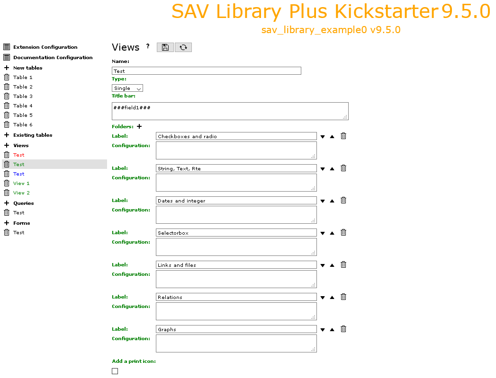

.. include:: ../../../Includes.txt

.. _kickstarterMenu.views:

=====
Views
=====

This item opens the form used to generate the views of the extension.

.. tip::
   
   Click on the icons at the right hand side of **Views**:
   
   - to access to this section of the documentation.
   - to save the configuration
   - to generate the extension.
   
- **Name**: sets the name of the view.

- **Type**: use the selector to set the type of the view. 
  It is either **List**, **Single**, **Edit** or **Update**.

- **Titlebar**: the content of this field be displayed as the title bar of the view.
  If markers **###fieldName###** are used, they will be replaced by the label associated 
  with the fieldname for a **List** view. For **Single** or **Edit** views, they will 
  be replaced by the value in the main table by default.
   
  - Use **###tableName.fieldName###** if you want to access to a field which is in another table.
  - By default the raw content of the table is displayed. Use **###render[fieldName]###** or 
    **###render[tableName.fieldName]###** when rendering is required like dates or selector boxes.
  - Localization by means of the file locallang.xlf can be used with **$$$tag$$$** which will be 
    replaced by its value according to the configuration language. The marker **$$$label[fieldName]$$$**
    will be replaced by the fieldName title according to the localization. 
    By default, the main table is assumed. Use **$$$label[tableName.fieldName]$$$** if necessary.

- **Item template**: this field is for the template for the **List**, **Update** or **Print** views. 
  The fields to include are defined using markers **###fieldName###**. Markers **###tablename.fieldname###** 
  can also be used. In this case, no rendering processing is performed, the marker is replaced by the value 
  in the selected row.

  In the case of a view **Update** or **Print**, markers **###field[fieldName, label]###** generate 
  the display of the label (localization can be used with **$$$tag$$$** or **$$$label[fieldName]$$$)**, 
  the current value of field **fieldName** and an input element for update.
  Markers **###newfield[fieldName, label]###** generate the display of the label and an input element 
  for the field **fieldName**. 
  In both cases, label and field will be wrapped with default CSS classes

  - updateCol1 to updateCol4 for an **Update** view, respectively for the label, the previous value, 
    the input value, the checkbox.
  - printCol1 and printCol2 for a **Print** view respectively for the label, the field.

  If you do not want this wrapping, just use **$$$label[fieldName]$$$** for the label and 
  **###field[fieldName]###** for the field.

- **Folders**: this item is shown in the **Single** and **Edit** views.Click on the icon to 
  add a folder and fill its label.
  If the label is defined in the file locallang.xlf, it will be translated to the selected language.
  Folder can be deleted or ordered using the icons. See the extension `sav_library_example0 
  <https://extensions.typo3.org/extension/sav_library_example0>`_  for
  an example.

  Folder configuration parameters can be added. Each parameter should be under the same format as
  the format for the field configuration.
  
  ::
  
     parameter = value;

  Conventional configuration parameters are:

  - **editAdminPlus = 1;**: for an **Edit** view, the folder can be edited if
    the frontend user has the **Admin+** right. To be an **Admin** frontend user, the user TSConfig 
    must contain a line as follows:
    
    ::
    
       extKey_Admin = value 

    **extKey** is the extension key and **value** is one of the possible value of the **Input Admin 
    Field** defined in the flexform associated with the extension.

    The frontend user becomes an **Admin+** user, if the user TSConfig contains a line as follows:
    
    ::
    
       extKey_Admin = value+

  - :ref:`cutIf <general.cutIf>` or :ref:`showIf <general.showIf>` conditions.
  
- **Add a print icon**: if set, a print icon is added to the view.