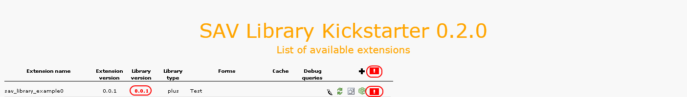
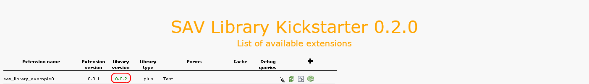

.. include:: ../../Includes.txt

.. _upgradingPreviouslyGeneratedExtensions:

=========================================
Upgrading Previously Generated Extensions
=========================================

The SAV Library Kickstarter comes with an upgrade feature which will
upgrade your extensions to the most recent version. When the SAV
Library version used for the extension generation is not the same as
the installed SAV Library version, the following display will be
obtained. The global upgrade icon can be used 
to upgrade extensions 10 by 10.

Click on the upgrade icon on the same line as the extension name to
upgrade it to the latest version of the code generator or click on the
icon at the right of the **plus** icon to upgrade all extensions that
need to be upgraded. Once upgraded, the upgrade icons will disappear
and the library version will be displayed in green as shown below.

For each extension in this list, several information are displayed:

- The name of the extension, that is the extension key. By clicking on
  the name, you will be able to edit the extension.

- The current version of the extension.

- The version of the SAV Library which has been used to generate the
  extension. If the version of the SAV Library is older than the
  installed version, the version will be displayed in red and the
  upgrade button will be displayed. In that case, please upgrade the
  extension by clicking on the upgrade icon.

- The library type which indicates the required library type for the
  extension. **Plus** is the default.

- The list of the forms used in the extension since one extension may
  contain several forms. For each form you can select if the plugin will
  behave as a USER for this form, that is caching will be possible. By
  default, the plugin will behave as a **USER_INT** for all forms, that is
  no caching is available. If you want to make a form behaving as a
  **USER**, edit the form section associated with your extension and check
  the **Allow caching** flag.

- The debug queries flag which indicates whether you have set this flag
  in the extension configuration view. This flag should only be used
  during development.

- A set of icons is also displayed. From left to right their respective
  actions are : edit the extension, generate the extension, copy the
  extension and instal/uninstall the extension.
