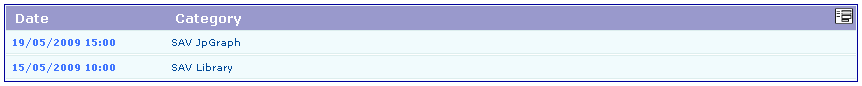
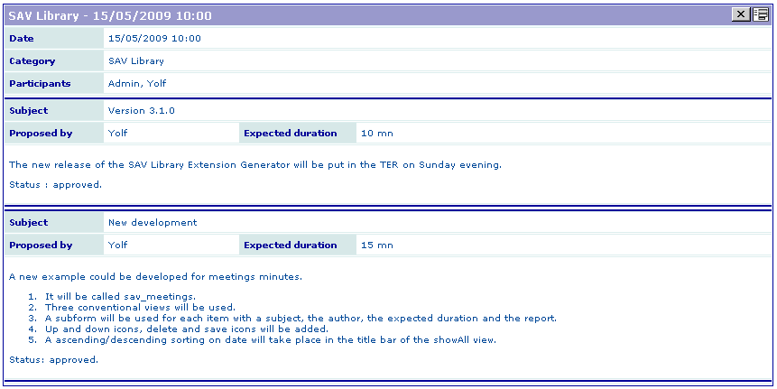
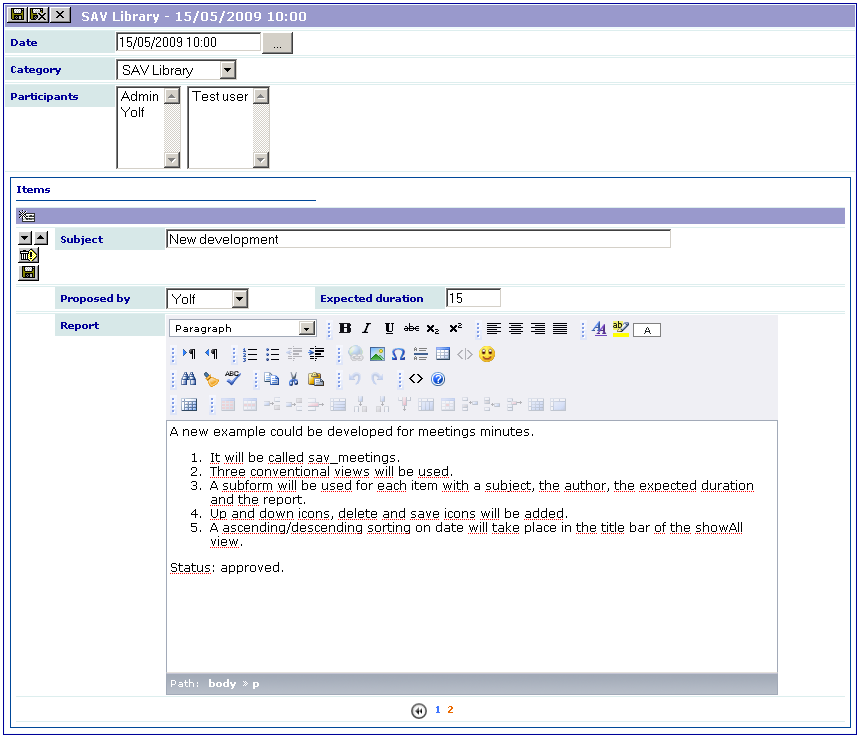

.. include:: ../Includes.txt

.. _introduction:

============
Introduction
============

What Does it Do?
================

This extension was created with the `SAV Library Kickstarter <http://t
ypo3.org/extensions/repository/view/sav_library_kickstarter>`_ in
order to be used with the `SAV Library Plus
<http://typo3.org/extensions/repository/view/sav_library_plus>`_
extension.

The SAV Library Extension Kickstarter makes it possible to directly
build extensions  **without any PHP coding**, thanks to simple
configuration parameters.

The SAV Library Kickstarter includes:

- Creation of multiple views of the data,

- Frontend input of the data,

- Views with folders,

- Context Sensitive Help,

- Generation of emails,

- Generation of RTF files using database tags,

- Data export in CSV format,

- Many other features.

This extension was designed to enter and display the minutes of a meeting for 
a group of FE users, for example a management team or a development team. 
Each member of the group may enter items that will be discussed during the 
meeting. A meeting has a date and belongs to a category (for example a project 
for a development team). An item is proposed by a member of the group. It 
has a name and an expected duration. A report is associated with it. Up and 
down icons are displayed to reorganize the items. A delete icon makes it 
possible to delete one item. A save button with an anchor is displayed to 
make the saving more comfortable when the minutes are taken during the meeting.

Screenshots
===========

List view
---------

Single view
-----------

Edit view
---------

